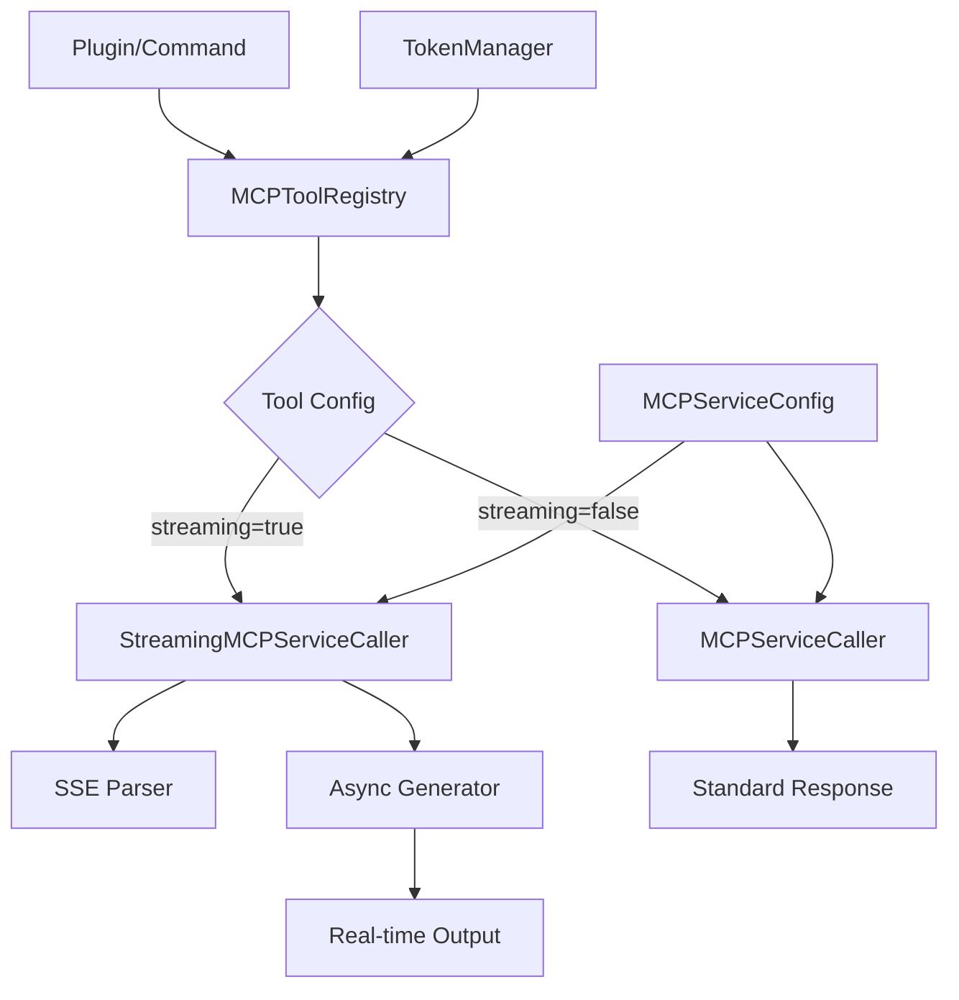

# Design Document: Streaming HTTP Support

## Overview

为 MCP 工具调用系统添加流式 HTTP 响应支持，使系统能够处理 Server-Sent Events (SSE) 和 chunked transfer encoding 格式的流式响应。该功能将与现有的 `MCPServiceCaller` 和 `MCPToolRegistry` 无缝集成，支持 AI 模型调用、大文件处理等需要实时输出的场景，同时保持对现有非流式工具的完全向后兼容。

核心设计原则：
- 最小侵入性：通过扩展而非修改现有代码实现流式支持
- 配置驱动：每个工具可独立配置是否启用流式模式
- 用户隔离：流式响应同样遵循用户 token 隔离原则
- 错误恢复：优雅处理流式传输中的中断和错误

## Architecture



## Main Workflow

```mermaid
sequenceDiagram
    participant User
    participant Plugin
    participant Registry as MCPToolRegistry
    participant Caller as StreamingMCPServiceCaller
    participant MCP as MCP Server
    participant Parser as SSEParser
    
    User->>Plugin: Call streaming tool
    Plugin->>Registry: call_tool(streaming=true)
    Registry->>Caller: call_service_streaming()
    Caller->>MCP: POST with Accept: text/event-stream
    
    loop Stream chunks
        MCP-->>Caller: SSE chunk
        Caller->>Parser: parse_sse_line()
        Parser-->>Caller: parsed event
        Caller-->>Registry: yield chunk
        Registry-->>Plugin: yield chunk
        Plugin-->>User: Display chunk
    end
    
    MCP-->>Caller: Stream complete
    Caller-->>Registry: Final result
    Registry-->>Plugin: Complete


## Components and Interfaces

### Component 1: StreamingMCPServiceCaller

**Purpose**: 扩展 `MCPServiceCaller` 以支持流式 HTTP 响应处理

**Interface**:
```python
class StreamingMCPServiceCaller(MCPServiceCaller):
    """流式 MCP 服务调用器
    
    继承自 MCPServiceCaller，添加流式响应处理能力。
    支持 SSE 和 chunked transfer encoding。
    """
    
    async def call_service_streaming(
        self,
        platform: str,
        user_id: str,
        service_name: str,
        **kwargs
    ) -> AsyncGenerator[Dict[str, Any], None]:
        """流式调用 MCP 服务
        
        Args:
            platform: 用户平台
            user_id: 用户ID
            service_name: 服务名称
            **kwargs: 服务参数
            
        Yields:
            Dict[str, Any]: 流式响应块
                {"type": "chunk", "data": <数据块>}
                {"type": "error", "error": <错误消息>}
                {"type": "complete", "total_chunks": <总块数>}
        """
        pass
    
    async def _stream_response(
        self,
        response: aiohttp.ClientResponse
    ) -> AsyncGenerator[bytes, None]:
        """从 HTTP 响应中流式读取数据
        
        Args:
            response: aiohttp 响应对象
            
        Yields:
            bytes: 数据块
        """
        pass

**Responsibilities**:
- 继承 `MCPServiceCaller` 的所有功能
- 实现流式 HTTP 请求（设置 Accept: text/event-stream）
- 使用 aiohttp 的流式 API 逐块读取响应
- 解析 SSE 格式数据
- 通过异步生成器 yield 数据块
- 处理流式传输中的错误和中断
- 维护流式传输统计信息（块数、字节数、耗时）

### Component 2: SSEParser

**Purpose**: 解析 Server-Sent Events 格式的流式数据

**Interface**:
```python
class SSEParser:
    """SSE 事件解析器
    
    解析符合 SSE 规范的流式数据。
    """
    
    def __init__(self):
        """初始化解析器"""
        self._buffer: str = ""
    
    def parse_sse_line(self, line: str) -> Optional[Dict[str, Any]]:
        """解析单行 SSE 数据
        
        Args:
            line: SSE 数据行
            
        Returns:
            解析后的事件字典，如果不是完整事件则返回 None
                {"event": <事件类型>, "data": <数据>, "id": <事件ID>}
        """
        pass
    
    def parse_sse_chunk(self, chunk: bytes) -> List[Dict[str, Any]]:
        """解析 SSE 数据块
        
        Args:
            chunk: 原始字节数据块
            
        Returns:
            解析出的事件列表
        """
        pass
    
    def reset(self) -> None:
        """重置解析器状态"""
        pass

**Responsibilities**:
- 解析 SSE 格式的数据行（event:, data:, id:, retry:）
- 处理多行数据字段
- 维护解析缓冲区处理不完整的数据块
- 识别事件边界（空行分隔）
- 支持 SSE 注释行（以 : 开头）
- 处理 UTF-8 编码

### Component 3: StreamingToolConfig

**Purpose**: 为工具添加流式配置选项

**Interface**:
```python
@dataclass
class StreamingToolConfig:
    """流式工具配置
    
    定义工具的流式行为配置。
    """
    
    enabled: bool = False
    """是否启用流式模式"""
    
    chunk_size: int = 8192
    """每次读取的数据块大小（字节）"""
    
    timeout: Optional[int] = None
    """流式传输超时时间（秒），None 表示使用全局配置"""
    
    buffer_size: int = 10
    """内部缓冲区大小（事件数量）"""
    
    retry_on_disconnect: bool = True
    """连接断开时是否自动重试"""
    
    max_reconnect_attempts: int = 3
    """最大重连次数"""

**Responsibilities**:
- 定义工具级别的流式配置
- 提供合理的默认值
- 支持配置验证
- 可序列化为 JSON（用于存储和传输）


### Component 4: MCPTool Extension

**Purpose**: 扩展 `MCPTool` 类以支持流式配置

**Interface**:
```python
class MCPTool:
    """MCP 工具（扩展版本）
    
    添加流式配置支持。
    """
    
    def __init__(
        self,
        name: str,
        description: str,
        parameters: Dict[str, Any],
        endpoint: str,
        method: str = "POST",
        streaming_config: Optional[StreamingToolConfig] = None
    ):
        """初始化工具
        
        Args:
            name: 工具名称
            description: 工具描述
            parameters: 参数 schema
            endpoint: API 端点
            method: HTTP 方法
            streaming_config: 流式配置（可选）
        """
        pass
    
    @property
    def is_streaming(self) -> bool:
        """工具是否支持流式模式"""
        return self.streaming_config is not None and self.streaming_config.enabled
    
    def to_dict(self) -> Dict[str, Any]:
        """转换为字典（包含流式配置）"""
        pass
    
    @classmethod
    def from_dict(cls, data: Dict[str, Any]) -> "MCPTool":
        """从字典创建（解析流式配置）"""
        pass

**Responsibilities**:
- 存储工具的流式配置
- 提供流式模式判断方法
- 支持配置的序列化和反序列化
- 保持向后兼容（streaming_config 为可选）

### Component 5: MCPToolRegistry Extension

**Purpose**: 扩展 `MCPToolRegistry` 以支持流式工具调用

**Interface**:
```python
class MCPToolRegistry:
    """MCP 工具注册表（扩展版本）
    
    添加流式工具调用支持。
    """
    
    def __init__(
        self,
        token_manager: TokenManager,
        mcp_config: Optional[MCPServiceConfig] = None,
        streaming_caller: Optional[StreamingMCPServiceCaller] = None
    ):
        """初始化注册表
        
        Args:
            token_manager: Token 管理器
            mcp_config: MCP 配置
            streaming_caller: 流式调用器（可选，默认自动创建）
        """
        pass
    
    async def call_tool_streaming(
        self,
        platform: str,
        user_id: str,
        tool_name: str,
        **params
    ) -> AsyncGenerator[Dict[str, Any], None]:
        """流式调用工具
        
        Args:
            platform: 用户平台
            user_id: 用户ID
            tool_name: 工具名称
            **params: 工具参数
            
        Yields:
            Dict[str, Any]: 流式响应
        """
        pass
    
    async def call_tool(
        self,
        platform: str,
        user_id: str,
        tool_name: str,
        **params
    ) -> Dict[str, Any]:
        """调用工具（自动检测流式/非流式）
        
        根据工具配置自动选择流式或非流式调用。
        如果是流式工具，收集所有块后返回完整结果。
        """
        pass

**Responsibilities**:
- 管理流式调用器实例
- 根据工具配置选择调用方式
- 提供流式和非流式两种调用接口
- 维护用户隔离（流式调用同样使用用户 token）
- 处理流式调用的错误和超时


## Data Models

### Model 1: StreamChunk

```python
@dataclass
class StreamChunk:
    """流式响应数据块
    
    表示流式传输中的单个数据块。
    """
    
    type: str
    """块类型: 'chunk', 'error', 'complete', 'metadata'"""
    
    data: Optional[Any] = None
    """数据内容（type='chunk' 时）"""
    
    error: Optional[str] = None
    """错误消息（type='error' 时）"""
    
    metadata: Optional[Dict[str, Any]] = None
    """元数据（type='metadata' 或 'complete' 时）"""
    
    timestamp: float = field(default_factory=time.time)
    """时间戳"""
    
    sequence: int = 0
    """序列号（用于排序和去重）"""

**Validation Rules**:
- `type` 必须是 'chunk', 'error', 'complete', 'metadata' 之一
- `type='chunk'` 时 `data` 不能为 None
- `type='error'` 时 `error` 不能为 None
- `sequence` 必须是非负整数

### Model 2: SSEEvent

```python
@dataclass
class SSEEvent:
    """SSE 事件
    
    表示解析后的 Server-Sent Event。
    """
    
    event: str = "message"
    """事件类型，默认为 'message'"""
    
    data: str = ""
    """事件数据"""
    
    id: Optional[str] = None
    """事件 ID（用于断点续传）"""
    
    retry: Optional[int] = None
    """重连延迟（毫秒）"""

**Validation Rules**:
- `event` 不能为空字符串
- `data` 可以为空但不能为 None
- `retry` 如果存在必须是正整数

### Model 3: StreamingStats

```python
@dataclass
class StreamingStats:
    """流式传输统计信息
    
    记录流式传输的性能和状态数据。
    """
    
    total_chunks: int = 0
    """总块数"""
    
    total_bytes: int = 0
    """总字节数"""
    
    start_time: float = field(default_factory=time.time)
    """开始时间"""
    
    end_time: Optional[float] = None
    """结束时间"""
    
    errors: List[str] = field(default_factory=list)
    """错误列表"""
    
    reconnect_count: int = 0
    """重连次数"""
    
    @property
    def duration(self) -> float:
        """传输持续时间（秒）"""
        if self.end_time is None:
            return time.time() - self.start_time
        return self.end_time - self.start_time
    
    @property
    def throughput(self) -> float:
        """吞吐量（字节/秒）"""
        duration = self.duration
        if duration == 0:
            return 0.0
        return self.total_bytes / duration

**Validation Rules**:
- 所有计数器必须是非负整数
- `end_time` 如果存在必须大于 `start_time`
- `errors` 列表中的每个元素必须是字符串


## Key Functions with Formal Specifications

### Function 1: call_service_streaming()

```python
async def call_service_streaming(
    self,
    platform: str,
    user_id: str,
    service_name: str,
    **kwargs
) -> AsyncGenerator[Dict[str, Any], None]:
    """流式调用 MCP 服务"""
```

**Preconditions:**
- `platform` 和 `user_id` 是非空字符串
- 用户已绑定有效的 token
- `service_name` 在配置中存在
- 服务支持流式响应（返回 text/event-stream）

**Postconditions:**
- 生成器 yield 的每个字典包含 'type' 字段
- 最后一个 yield 的 type 为 'complete' 或 'error'
- 如果成功，至少 yield 一个 type='chunk' 的数据
- 所有 yield 的数据都是有效的 StreamChunk 字典
- 连接在生成器结束时正确关闭

**Loop Invariants:**
- 在流式读取循环中，已处理的块数等于 stats.total_chunks
- 每个 yield 的 sequence 严格递增
- 累计字节数等于所有已处理块的字节数之和

### Function 2: parse_sse_chunk()

```python
def parse_sse_chunk(self, chunk: bytes) -> List[Dict[str, Any]]:
    """解析 SSE 数据块"""
```

**Preconditions:**
- `chunk` 是有效的字节序列
- 解析器已初始化（_buffer 存在）

**Postconditions:**
- 返回的列表中每个元素都是有效的 SSEEvent 字典
- 不完整的数据保留在 _buffer 中
- 解析后的事件按接收顺序排列
- 空行被正确识别为事件分隔符

**Loop Invariants:**
- 在行处理循环中，_buffer 始终包含未处理的完整行
- 已解析的事件数量等于遇到的空行数量
- 每个事件的字段都符合 SSE 规范

### Function 3: _stream_response()

```python
async def _stream_response(
    self,
    response: aiohttp.ClientResponse
) -> AsyncGenerator[bytes, None]:
    """从 HTTP 响应中流式读取数据"""
```

**Preconditions:**
- `response` 是有效的 aiohttp.ClientResponse 对象
- 响应状态码为 200
- 响应的 Content-Type 包含 'text/event-stream' 或 'application/octet-stream'

**Postconditions:**
- yield 的每个字节块大小不超过配置的 chunk_size
- 所有响应数据都被完整读取
- 读取错误时抛出适当的异常
- 生成器结束时响应流已关闭

**Loop Invariants:**
- 在读取循环中，已读取的总字节数等于所有 yield 块的大小之和
- 每次迭代都检查超时和取消条件
- 连接状态在每次读取前都是有效的

### Function 4: validate_streaming_config()

```python
def validate_streaming_config(config: StreamingToolConfig) -> bool:
    """验证流式配置的有效性"""
```

**Preconditions:**
- `config` 是 StreamingToolConfig 实例或字典

**Postconditions:**
- 返回 True 当且仅当所有配置参数都在有效范围内
- chunk_size 在 1024 到 1048576 之间
- buffer_size 在 1 到 1000 之间
- max_reconnect_attempts 在 0 到 10 之间
- timeout 如果存在必须是正整数

**Loop Invariants:** N/A（无循环）


## Algorithmic Pseudocode

### Main Streaming Algorithm

```python
async def call_service_streaming(
    self,
    platform: str,
    user_id: str,
    service_name: str,
    **kwargs
) -> AsyncGenerator[Dict[str, Any], None]:
    """
    INPUT: platform, user_id, service_name, kwargs
    OUTPUT: AsyncGenerator yielding StreamChunk dictionaries
    
    PRECONDITION: user has valid token AND service exists
    POSTCONDITION: all chunks yielded OR error raised
    """
    
    # Step 1: Get user token
    token = await self.token_manager.get_user_token(platform, user_id)
    if token is None:
        yield {"type": "error", "error": "用户未绑定token"}
        return
    
    # Step 2: Build request
    service_url = self.config.get_service_url(service_name)
    headers = {
        "Authorization": f"Bearer {token}",
        "Content-Type": "application/json",
        "Accept": "text/event-stream"
    }
    
    # Step 3: Initialize streaming state
    stats = StreamingStats()
    sequence = 0
    parser = SSEParser()
    
    try:
        # Step 4: Make streaming HTTP request
        timeout = aiohttp.ClientTimeout(total=None)  # No total timeout for streaming
        
        async with aiohttp.ClientSession() as session:
            async with session.post(
                service_url,
                headers=headers,
                json=kwargs,
                timeout=timeout,
                ssl=self.config.verify_ssl
            ) as response:
                
                # Step 5: Validate response
                if response.status != 200:
                    error_text = await response.text()
                    yield {
                        "type": "error",
                        "error": f"HTTP {response.status}: {error_text}"
                    }
                    return
                
                # Step 6: Stream response chunks
                # LOOP INVARIANT: stats.total_chunks == number of chunks processed
                async for chunk in response.content.iter_chunked(self.chunk_size):
                    stats.total_bytes += len(chunk)
                    
                    # Parse SSE events from chunk
                    events = parser.parse_sse_chunk(chunk)
                    
                    # Yield each parsed event
                    for event in events:
                        sequence += 1
                        stats.total_chunks += 1
                        
                        yield {
                            "type": "chunk",
                            "data": event["data"],
                            "metadata": {
                                "event": event.get("event", "message"),
                                "id": event.get("id"),
                                "sequence": sequence
                            },
                            "timestamp": time.time()
                        }
                
                # Step 7: Complete streaming
                stats.end_time = time.time()
                yield {
                    "type": "complete",
                    "metadata": {
                        "total_chunks": stats.total_chunks,
                        "total_bytes": stats.total_bytes,
                        "duration": stats.duration,
                        "throughput": stats.throughput
                    }
                }
    
    except asyncio.TimeoutError:
        stats.errors.append("Timeout")
        yield {"type": "error", "error": "流式传输超时"}
    
    except aiohttp.ClientError as e:
        stats.errors.append(str(e))
        yield {"type": "error", "error": f"网络错误: {str(e)}"}
    
    except Exception as e:
        stats.errors.append(str(e))
        yield {"type": "error", "error": f"未知错误: {str(e)}"}

```

### SSE Parsing Algorithm

```python
def parse_sse_chunk(self, chunk: bytes) -> List[Dict[str, Any]]:
    """
    INPUT: chunk (bytes) - raw SSE data chunk
    OUTPUT: List[SSEEvent] - parsed events
    
    PRECONDITION: chunk is valid bytes sequence
    POSTCONDITION: all complete events extracted, incomplete data buffered
    """
    
    events = []
    current_event = SSEEvent()
    
    # Step 1: Decode chunk and add to buffer
    try:
        text = chunk.decode('utf-8')
    except UnicodeDecodeError:
        # Handle partial UTF-8 sequences
        text = chunk.decode('utf-8', errors='ignore')
    
    self._buffer += text
    
    # Step 2: Split into lines
    lines = self._buffer.split('\n')
    
    # Keep last incomplete line in buffer
    self._buffer = lines[-1]
    lines = lines[:-1]
    
    # Step 3: Process each line
    # LOOP INVARIANT: all processed lines are complete
    for line in lines:
        line = line.rstrip('\r')
        
        # Empty line = event boundary
        if not line:
            if current_event.data or current_event.event != "message":
                events.append(current_event.to_dict())
                current_event = SSEEvent()
            continue
        
        # Comment line (ignore)
        if line.startswith(':'):
            continue
        
        # Parse field
        if ':' in line:
            field, _, value = line.partition(':')
            value = value.lstrip(' ')
            
            if field == 'event':
                current_event.event = value
            elif field == 'data':
                if current_event.data:
                    current_event.data += '\n' + value
                else:
                    current_event.data = value
            elif field == 'id':
                current_event.id = value
            elif field == 'retry':
                try:
                    current_event.retry = int(value)
                except ValueError:
                    pass  # Ignore invalid retry values
    
    return events
```

### Tool Call with Auto-Detection Algorithm

```python
async def call_tool(
    self,
    platform: str,
    user_id: str,
    tool_name: str,
    **params
) -> Dict[str, Any]:
    """
    INPUT: platform, user_id, tool_name, params
    OUTPUT: Dict with success/error and data
    
    PRECONDITION: tool exists in user's registry
    POSTCONDITION: returns complete result (streaming or non-streaming)
    """
    
    # Step 1: Get tool from registry
    user_key = self._get_user_key(platform, user_id)
    tool = self._registry[user_key].get(tool_name)
    
    if tool is None:
        return {"success": False, "error": "工具不存在"}
    
    # Step 2: Check if tool supports streaming
    if tool.is_streaming:
        # Step 3a: Streaming call - collect all chunks
        chunks = []
        
        async for chunk in self.call_tool_streaming(
            platform, user_id, tool_name, **params
        ):
            if chunk["type"] == "chunk":
                chunks.append(chunk["data"])
            elif chunk["type"] == "error":
                return {"success": False, "error": chunk["error"]}
            elif chunk["type"] == "complete":
                return {
                    "success": True,
                    "data": chunks,
                    "metadata": chunk.get("metadata"),
                    "streaming": True
                }
        
        # Should not reach here
        return {"success": False, "error": "流式传输异常结束"}
    
    else:
        # Step 3b: Non-streaming call (existing logic)
        return await self._call_tool_non_streaming(
            platform, user_id, tool_name, **params
        )
```


## Example Usage

### Example 1: Basic Streaming Tool Call

```python
# Initialize components
token_manager = TokenManager(db_manager, encryption)
mcp_config = MCPServiceConfig()
streaming_caller = StreamingMCPServiceCaller(token_manager, mcp_config)
registry = MCPToolRegistry(token_manager, mcp_config, streaming_caller)

# Register user tools
await registry.register_user_tools("qq", "123456")

# Call streaming tool
async for chunk in registry.call_tool_streaming(
    platform="qq",
    user_id="123456",
    tool_name="ai_chat",
    prompt="Tell me a story"
):
    if chunk["type"] == "chunk":
        # Display chunk in real-time
        print(chunk["data"], end="", flush=True)
    elif chunk["type"] == "error":
        print(f"\nError: {chunk['error']}")
        break
    elif chunk["type"] == "complete":
        print(f"\n\nCompleted: {chunk['metadata']['total_chunks']} chunks")
```

### Example 2: Non-Streaming Tool (Backward Compatible)

```python
# Call non-streaming tool (existing behavior)
result = await registry.call_tool(
    platform="qq",
    user_id="123456",
    tool_name="translate",
    text="Hello",
    target_lang="zh"
)

if result["success"]:
    print(f"Translation: {result['data']}")
else:
    print(f"Error: {result['error']}")
```

### Example 3: Auto-Detection (Streaming Tool)

```python
# call_tool automatically detects streaming and collects all chunks
result = await registry.call_tool(
    platform="qq",
    user_id="123456",
    tool_name="ai_chat",  # This is a streaming tool
    prompt="Hello"
)

if result["success"]:
    # All chunks collected in data
    full_response = "".join(result["data"])
    print(f"Full response: {full_response}")
    print(f"Streaming: {result['streaming']}")  # True
```

### Example 4: Plugin Integration with Real-time Display

```python
class StreamingToolCommand:
    """Plugin command for streaming tool calls"""
    
    async def handle_streaming_call(self, message_event, tool_name: str, **params):
        """Handle streaming tool call with real-time output"""
        
        platform = message_event.platform
        user_id = message_event.user_id
        
        # Send initial message
        await self.send_message(message_event, "正在调用工具，请稍候...")
        
        # Collect chunks for display
        response_text = ""
        last_update = time.time()
        
        async for chunk in self.registry.call_tool_streaming(
            platform, user_id, tool_name, **params
        ):
            if chunk["type"] == "chunk":
                response_text += chunk["data"]
                
                # Update message every 0.5 seconds
                if time.time() - last_update > 0.5:
                    await self.update_message(message_event, response_text)
                    last_update = time.time()
            
            elif chunk["type"] == "error":
                await self.send_message(
                    message_event,
                    f"❌ 错误: {chunk['error']}"
                )
                return
            
            elif chunk["type"] == "complete":
                # Final update
                await self.update_message(message_event, response_text)
                
                # Show statistics
                metadata = chunk["metadata"]
                stats_msg = (
                    f"\n\n📊 统计:\n"
                    f"- 数据块: {metadata['total_chunks']}\n"
                    f"- 字节数: {metadata['total_bytes']}\n"
                    f"- 耗时: {metadata['duration']:.2f}秒"
                )
                await self.send_message(message_event, stats_msg)
```

### Example 5: Error Handling and Reconnection

```python
async def call_with_retry(registry, platform, user_id, tool_name, **params):
    """Call streaming tool with automatic retry on disconnect"""
    
    max_retries = 3
    retry_count = 0
    
    while retry_count < max_retries:
        try:
            chunks = []
            
            async for chunk in registry.call_tool_streaming(
                platform, user_id, tool_name, **params
            ):
                if chunk["type"] == "chunk":
                    chunks.append(chunk["data"])
                elif chunk["type"] == "error":
                    if "网络错误" in chunk["error"] and retry_count < max_retries - 1:
                        # Retry on network error
                        retry_count += 1
                        await asyncio.sleep(2 ** retry_count)  # Exponential backoff
                        break
                    else:
                        raise Exception(chunk["error"])
                elif chunk["type"] == "complete":
                    return {"success": True, "data": chunks}
            
        except Exception as e:
            if retry_count >= max_retries - 1:
                return {"success": False, "error": str(e)}
            retry_count += 1
            await asyncio.sleep(2 ** retry_count)
    
    return {"success": False, "error": "Max retries exceeded"}
```

### Example 6: SSE Parser Usage

```python
# Create parser
parser = SSEParser()

# Parse SSE data
sse_data = b"""event: message
data: Hello
data: World

event: status
data: {"progress": 50}
id: msg-123

"""

events = parser.parse_sse_chunk(sse_data)

for event in events:
    print(f"Event: {event['event']}")
    print(f"Data: {event['data']}")
    print(f"ID: {event.get('id')}")
    print("---")

# Output:
# Event: message
# Data: Hello
# World
# ID: None
# ---
# Event: status
# Data: {"progress": 50}
# ID: msg-123
# ---
```


## Correctness Properties

*A property is a characteristic or behavior that should hold true across all valid executions of a system—essentially, a formal statement about what the system should do. Properties serve as the bridge between human-readable specifications and machine-verifiable correctness guarantees.*

### Property 1: HTTP 请求头设置正确性

*For any* 流式请求，HTTP 请求头中应包含 Accept: text/event-stream 和正确的 Authorization 头

**Validates: Requirements 1.1, 1.5**

### Property 2: Token 验证前置性

*For any* 流式调用，如果用户 token 无效或不存在，系统应在发起 HTTP 请求前立即返回错误

**Validates: Requirements 1.3, 1.4**

### Property 3: SSE 解析往返属性

*For any* 有效的 SSE 事件，将其格式化为 SSE 文本后再解析，应得到等价的事件对象

**Validates: Requirements 2.1, 2.2, 2.3, 2.4, 2.5, 2.7**

### Property 4: SSE 注释忽略

*For any* SSE 数据流，所有以冒号开头的行应被识别为注释并在解析结果中被忽略

**Validates: Requirements 2.6**

### Property 5: SSE 缓冲区不变性

*For any* SSE 数据流，无论在何处分割数据块，最终解析出的事件序列应保持一致

**Validates: Requirements 2.8**

### Property 6: 数据块序列单调性

*For any* 流式传输，所有 yield 的数据块的 sequence 序列号应严格递增，且没有数据块丢失

**Validates: Requirements 3.6, 13.1, 13.2**

### Property 7: 数据块结构完整性

*For any* 被 yield 的数据块，应包含 type 字段，且根据 type 值包含相应的必需字段（chunk 类型包含 data 和 sequence，error 类型包含 error，complete 类型包含 metadata）

**Validates: Requirements 3.2, 3.3, 3.4, 3.5**

### Property 8: 流式传输完成保证

*For any* 成功的流式传输，最后一个 yield 的数据块应为 type='complete'，且其 metadata 中的 total_chunks 应与实际 yield 的 chunk 数量一致

**Validates: Requirements 3.7, 13.3**

### Property 9: 工具流式识别正确性

*For any* 工具，当且仅当其 streaming_config 存在且 enabled 为 true 时，应被识别为流式工具

**Validates: Requirements 4.2, 4.3, 11.4**

### Property 10: 配置参数范围验证

*For any* streaming_config，chunk_size 应在 [1024, 1048576] 范围内，buffer_size 应在 [1, 1000] 范围内，max_reconnect_attempts 应在 [0, 10] 范围内

**Validates: Requirements 4.4, 4.5, 4.6**

### Property 11: 工具配置序列化往返

*For any* 包含 streaming_config 的工具，序列化后再反序列化应得到等价的配置对象

**Validates: Requirements 4.7**

### Property 12: 工具调用自动路由

*For any* 工具调用，系统应根据工具的 is_streaming 属性自动选择使用 StreamingCaller 或标准 MCPServiceCaller

**Validates: Requirements 5.1, 5.2, 5.3**

### Property 13: 流式工具数据收集完整性

*For any* 通过 call_tool 调用的流式工具，返回结果中应包含所有 yield 的数据块

**Validates: Requirements 5.4**

### Property 14: 用户 Token 隔离

*For any* 两个不同用户对同一流式工具的调用，每个调用应使用各自用户的 token，且并发调用时 token 不会混淆

**Validates: Requirements 6.1, 6.2, 6.3**

### Property 15: Token 日志安全性

*For any* 日志记录和错误信息，不应包含完整的 token 内容，最多只记录最后 4 个字符

**Validates: Requirements 6.4, 14.3, 14.4**

### Property 16: 错误后终止保证

*For any* 流式传输，一旦 yield 了 type='error' 的数据块，之后不应再 yield 任何其他数据块

**Validates: Requirements 7.6**

### Property 17: HTTP 错误状态码处理

*For any* HTTP 响应状态码非 200 的情况，系统应 yield error 类型数据块并包含状态码信息

**Validates: Requirements 7.2**

### Property 18: SSE 解析容错性

*For any* 包含格式错误的 SSE 数据流，解析器应记录警告并继续解析后续有效数据

**Validates: Requirements 7.5**

### Property 19: 资源清理保证

*For any* 流式传输（无论正常结束还是异常终止），HTTP 连接应被正确关闭，相关资源应被释放

**Validates: Requirements 7.7, 10.3, 10.4**

### Property 20: 重连指数退避

*For any* 重连尝试序列，相邻两次重连之间的延迟应遵循指数退避策略（1秒、2秒、4秒...）

**Validates: Requirements 8.2**

### Property 21: 重连次数限制

*For any* 启用重连的流式传输，当重连次数达到 max_reconnect_attempts 时，应停止重试并返回错误

**Validates: Requirements 8.3**

### Property 22: 重连统计记录

*For any* 发生重连的流式传输，StreamingStats 中的 reconnect_count 应准确反映实际重连次数

**Validates: Requirements 8.5**

### Property 23: 统计信息完整性

*For any* 流式传输，StreamingStats 应记录开始时间、结束时间、总块数、总字节数和所有错误信息

**Validates: Requirements 9.1, 9.2, 9.3, 9.6**

### Property 24: 统计信息准确性

*For any* 流式传输，complete 数据块中的统计信息（总块数、总字节数、持续时间、吞吐量）应与实际传输数据一致

**Validates: Requirements 9.4, 9.5**

### Property 25: 并发调用限制

*For any* 用户，当其并发流式调用数达到限制（5个）时，新的调用请求应被拒绝并返回错误

**Validates: Requirements 10.2, 12.2, 12.3**

### Property 26: 并发计数器一致性

*For any* 流式调用（无论正常完成还是异常终止），完成后该用户的并发计数应正确减少

**Validates: Requirements 12.4, 12.5**

### Property 27: 向后兼容性保证

*For any* 非流式工具，调用行为和返回格式应与添加流式支持前保持完全一致

**Validates: Requirements 11.1, 11.2, 11.5, 5.5**

### Property 28: UTF-8 字符完整性

*For any* 在数据块边界被分割的 UTF-8 字符，系统应正确处理并保证字符的完整性

**Validates: Requirements 13.4**

### Property 29: 多行数据连接正确性

*For any* 包含多行 data: 字段的 SSE 事件，所有数据行应使用换行符 '\n' 正确连接

**Validates: Requirements 13.5, 2.7**

### Property 30: SSE 事件大小限制

*For any* 被解析的 SSE 事件，单个事件的大小不应超过 1MB

**Validates: Requirements 14.5**


## Error Handling

### Error Scenario 1: Network Disconnection During Streaming

**Condition**: TCP connection drops while streaming data

**Response**: 
- Catch `aiohttp.ClientError` or `asyncio.TimeoutError`
- Yield error chunk: `{"type": "error", "error": "网络连接中断"}`
- Record error in StreamingStats
- Terminate generator

**Recovery**:
- If `retry_on_disconnect=true` in config, attempt reconnection
- Use exponential backoff (1s, 2s, 4s, ...)
- Resume from last received event ID if supported by server
- Maximum reconnection attempts controlled by `max_reconnect_attempts`

### Error Scenario 2: Invalid SSE Format

**Condition**: Server sends malformed SSE data

**Response**:
- SSEParser logs warning for invalid lines
- Skip invalid lines and continue parsing
- If entire chunk is invalid, yield warning metadata
- Continue streaming (don't fail entire call)

**Recovery**:
- Accumulate warnings in StreamingStats
- If warnings exceed threshold (e.g., 10), yield error and stop
- Log detailed parsing errors for debugging

### Error Scenario 3: Token Expiration During Streaming

**Condition**: Token becomes invalid mid-stream (HTTP 401)

**Response**:
- Detect 401 status code
- Yield error chunk: `{"type": "error", "error": "Token已过期，请重新绑定"}`
- Do not retry (token issue requires user action)
- Terminate generator immediately

**Recovery**:
- User must rebind token using `/bind_token` command
- No automatic recovery possible
- Clear user's tool registry to force re-registration

### Error Scenario 4: Server-Side Error (HTTP 500)

**Condition**: MCP server returns 5xx error

**Response**:
- Read error response body
- Yield error chunk with server error details
- Record in StreamingStats
- Terminate generator

**Recovery**:
- If `max_retries > 0`, retry after delay
- Use exponential backoff
- If all retries fail, return final error to user
- Log server errors for monitoring

### Error Scenario 5: Streaming Timeout

**Condition**: No data received for extended period

**Response**:
- Detect timeout using `asyncio.wait_for()` or chunk-level timeout
- Yield error chunk: `{"type": "error", "error": "流式传输超时"}`
- Close connection
- Terminate generator

**Recovery**:
- If configured, attempt reconnection
- Use shorter timeout for reconnection attempts
- If reconnection fails, return timeout error

### Error Scenario 6: Buffer Overflow

**Condition**: SSE parser buffer grows too large (memory concern)

**Response**:
- Monitor buffer size in SSEParser
- If buffer exceeds limit (e.g., 1MB), yield error
- Clear buffer and terminate parsing
- Log buffer overflow event

**Recovery**:
- No automatic recovery (indicates malformed stream)
- User should report issue to MCP service provider
- Consider increasing buffer limit if legitimate use case

### Error Scenario 7: Concurrent Streaming Limit

**Condition**: Too many concurrent streaming calls for one user

**Response**:
- Track active streaming calls per user
- If limit exceeded (e.g., 5), reject new call
- Return error: `{"success": false, "error": "并发流式调用数量超限"}`

**Recovery**:
- User must wait for existing calls to complete
- Implement queue for pending streaming calls
- Provide status command to check active streams

### Error Scenario 8: Partial UTF-8 Sequence

**Condition**: Chunk boundary splits UTF-8 character

**Response**:
- Use `decode('utf-8', errors='ignore')` to handle gracefully
- Buffer incomplete sequences for next chunk
- Log warning if data loss occurs

**Recovery**:
- Automatic recovery by buffering
- Most cases handled transparently
- Rare data loss logged but doesn't stop stream


## Testing Strategy

### Unit Testing Approach

**Test Coverage Goals**: 90%+ code coverage for all streaming components

**Key Test Cases**:

1. **StreamingMCPServiceCaller Tests**:
   - Test successful streaming with mock SSE data
   - Test token validation before streaming
   - Test HTTP error handling (401, 500, etc.)
   - Test network timeout handling
   - Test connection cleanup on error
   - Test statistics collection accuracy

2. **SSEParser Tests**:
   - Test single-line event parsing
   - Test multi-line data field parsing
   - Test event boundary detection (empty lines)
   - Test comment line handling
   - Test incomplete data buffering
   - Test UTF-8 decoding edge cases
   - Test all SSE field types (event, data, id, retry)

3. **StreamingToolConfig Tests**:
   - Test default values
   - Test validation rules
   - Test serialization/deserialization
   - Test invalid configuration rejection

4. **MCPToolRegistry Extension Tests**:
   - Test streaming tool detection
   - Test auto-detection in call_tool()
   - Test streaming vs non-streaming routing
   - Test user isolation in streaming calls
   - Test concurrent streaming calls

**Testing Tools**:
- pytest for test framework
- pytest-asyncio for async test support
- aioresponses for mocking aiohttp requests
- pytest-cov for coverage reporting

### Property-Based Testing Approach

**Property Test Library**: Hypothesis (Python)

**Properties to Test**:

1. **SSE Parsing Idempotence**:
   - Property: Parsing the same SSE data multiple times produces identical results
   - Strategy: Generate random valid SSE streams, parse twice, compare outputs

2. **Chunk Sequence Monotonicity**:
   - Property: Sequence numbers in streaming output are strictly increasing
   - Strategy: Generate random streaming responses, verify sequence order

3. **Data Integrity**:
   - Property: Concatenating all chunk data equals original server response
   - Strategy: Generate random data, stream it, verify reconstruction

4. **Buffer Boundary Handling**:
   - Property: Splitting SSE data at any byte boundary produces same parsed events
   - Strategy: Generate SSE data, split at random positions, verify parsing

5. **Error Recovery Consistency**:
   - Property: Retry logic produces same result regardless of failure timing
   - Strategy: Inject failures at random points, verify final outcome

6. **Configuration Validation**:
   - Property: Invalid configs are always rejected, valid configs always accepted
   - Strategy: Generate random configs, verify validation consistency

**Hypothesis Strategies**:
```python
from hypothesis import given, strategies as st

@given(
    event_type=st.text(min_size=1, max_size=50),
    data=st.text(min_size=0, max_size=1000),
    event_id=st.one_of(st.none(), st.text(min_size=1, max_size=50))
)
def test_sse_parsing_roundtrip(event_type, data, event_id):
    """Test SSE parsing is consistent"""
    # Generate SSE format
    sse_lines = [f"event: {event_type}"]
    for line in data.split('\n'):
        sse_lines.append(f"data: {line}")
    if event_id:
        sse_lines.append(f"id: {event_id}")
    sse_lines.append("")  # Event boundary
    
    sse_text = '\n'.join(sse_lines)
    
    # Parse
    parser = SSEParser()
    events = parser.parse_sse_chunk(sse_text.encode('utf-8'))
    
    # Verify
    assert len(events) == 1
    assert events[0]['event'] == event_type
    assert events[0]['data'] == data
    assert events[0].get('id') == event_id
```

### Integration Testing Approach

**Integration Test Scenarios**:

1. **End-to-End Streaming Flow**:
   - Setup: Mock MCP server with SSE endpoint
   - Test: Complete flow from tool call to chunk display
   - Verify: All chunks received, statistics correct, cleanup done

2. **Multi-User Concurrent Streaming**:
   - Setup: Multiple users with different tokens
   - Test: Concurrent streaming calls from different users
   - Verify: User isolation maintained, no token mixing

3. **Streaming + Non-Streaming Mix**:
   - Setup: User with both streaming and non-streaming tools
   - Test: Call both tool types in sequence and concurrently
   - Verify: Correct routing, no interference

4. **Token Lifecycle During Streaming**:
   - Setup: User with active streaming call
   - Test: Unbind token while streaming
   - Verify: Streaming call fails gracefully, cleanup occurs

5. **Plugin Integration**:
   - Setup: Full AstrBot plugin environment
   - Test: Streaming tool call via chat command
   - Verify: Real-time message updates, proper formatting

**Mock Server Setup**:
```python
from aiohttp import web

async def mock_sse_endpoint(request):
    """Mock SSE streaming endpoint"""
    response = web.StreamResponse()
    response.headers['Content-Type'] = 'text/event-stream'
    response.headers['Cache-Control'] = 'no-cache'
    await response.prepare(request)
    
    # Send test events
    for i in range(5):
        data = f"event: message\ndata: Chunk {i}\n\n"
        await response.write(data.encode('utf-8'))
        await asyncio.sleep(0.1)
    
    await response.write_eof()
    return response
```

### Performance Testing

**Performance Metrics**:
- Throughput: bytes/second for streaming
- Latency: time to first chunk
- Memory usage: peak memory during streaming
- CPU usage: processing overhead
- Concurrent streams: maximum supported

**Performance Test Cases**:
1. Large stream (10MB+) throughput test
2. High-frequency small chunks latency test
3. Concurrent streaming (10+ users) load test
4. Long-running stream (1+ hour) stability test
5. Memory leak detection over extended period

**Performance Targets**:
- Throughput: > 1 MB/s per stream
- First chunk latency: < 100ms
- Memory overhead: < 10MB per stream
- Concurrent streams: 50+ per instance
- No memory leaks over 24 hours


## Performance Considerations

### Throughput Optimization

**Strategy**: Minimize per-chunk processing overhead

**Techniques**:
- Use efficient chunk size (8KB default, configurable)
- Avoid unnecessary data copying
- Use `iter_chunked()` instead of `iter_any()`
- Minimize logging in hot path
- Batch small chunks when possible

**Expected Performance**:
- Single stream: 1-5 MB/s (network-limited)
- CPU overhead: < 5% per stream
- Memory per stream: 1-2 MB

### Memory Management

**Strategy**: Prevent memory leaks and unbounded growth

**Techniques**:
- Limit SSE parser buffer size (1MB max)
- Use streaming iteration (no full buffering)
- Clear completed chunks from memory
- Implement backpressure if consumer is slow
- Monitor and limit concurrent streams per user

**Memory Limits**:
- Parser buffer: 1 MB
- Chunk buffer: 10 chunks (configurable)
- Total per stream: < 10 MB
- System-wide: Configurable limit

### Latency Optimization

**Strategy**: Minimize time to first chunk

**Techniques**:
- Reuse HTTP connections (connection pooling)
- Parallel token validation and request preparation
- Avoid blocking operations in async code
- Use efficient SSE parsing (no regex)
- Stream chunks immediately (no batching by default)

**Latency Targets**:
- Time to first chunk: < 100ms
- Inter-chunk latency: < 10ms
- End-to-end overhead: < 50ms

### Concurrency Handling

**Strategy**: Support multiple concurrent streams efficiently

**Techniques**:
- Use asyncio for non-blocking I/O
- Limit concurrent streams per user (default: 5)
- Share connection pool across streams
- Implement fair scheduling (no starvation)
- Monitor system resources and throttle if needed

**Concurrency Limits**:
- Per user: 5 concurrent streams
- System-wide: 100 concurrent streams (configurable)
- Connection pool: 50 connections

## Security Considerations

### Token Security in Streaming

**Threat**: Token exposure in logs or error messages

**Mitigation**:
- Never log full tokens (only last 4 chars)
- Sanitize error messages before yielding
- Use HTTPS for all streaming connections
- Validate SSL certificates by default
- Clear tokens from memory after use

### Resource Exhaustion Attacks

**Threat**: Malicious user opens many streaming connections

**Mitigation**:
- Limit concurrent streams per user (5)
- Implement rate limiting (10 calls/minute)
- Set maximum stream duration (1 hour)
- Monitor and alert on suspicious patterns
- Implement circuit breaker for failing streams

### Data Injection via SSE

**Threat**: Malicious server sends crafted SSE data

**Mitigation**:
- Validate SSE format strictly
- Sanitize event data before yielding
- Limit event size (1MB per event)
- Reject events with suspicious patterns
- Log and alert on validation failures

### User Isolation

**Threat**: Cross-user data leakage in streaming

**Mitigation**:
- Verify user token for every stream
- Isolate stream state per user
- No shared buffers between users
- Audit logging for all streaming calls
- Regular security testing

## Dependencies

### Core Dependencies

1. **aiohttp** (>= 3.8.0)
   - Purpose: Async HTTP client with streaming support
   - Features used: ClientSession, streaming response, SSE
   - License: Apache 2.0

2. **asyncio** (Python stdlib)
   - Purpose: Async/await support and event loop
   - Features used: AsyncGenerator, tasks, timeouts

### Optional Dependencies

1. **prometheus_client** (optional)
   - Purpose: Metrics collection for monitoring
   - Metrics: stream_duration, chunk_count, error_rate
   - License: Apache 2.0

2. **structlog** (optional)
   - Purpose: Structured logging for better debugging
   - Features: Context-aware logging, JSON output
   - License: MIT

### Integration Dependencies

1. **TokenManager** (existing)
   - Purpose: User token management
   - Interface: get_user_token()

2. **MCPServiceConfig** (existing)
   - Purpose: MCP service configuration
   - Interface: get_service_url(), timeout, verify_ssl

3. **DatabaseManager** (existing)
   - Purpose: Persistent storage (if needed for stream state)
   - Interface: store(), retrieve()

### Development Dependencies

1. **pytest** (>= 7.0.0)
   - Purpose: Testing framework

2. **pytest-asyncio** (>= 0.21.0)
   - Purpose: Async test support

3. **aioresponses** (>= 0.7.0)
   - Purpose: Mock aiohttp requests

4. **hypothesis** (>= 6.0.0)
   - Purpose: Property-based testing

5. **pytest-cov** (>= 4.0.0)
   - Purpose: Code coverage reporting

## Migration and Rollout Plan

### Phase 1: Core Implementation (Week 1-2)
- Implement StreamingMCPServiceCaller
- Implement SSEParser
- Add unit tests
- Code review and refinement

### Phase 2: Integration (Week 3)
- Extend MCPTool with streaming config
- Extend MCPToolRegistry with streaming support
- Add integration tests
- Performance testing

### Phase 3: Plugin Integration (Week 4)
- Add streaming commands to plugin
- Implement real-time message updates
- User acceptance testing
- Documentation

### Phase 4: Rollout (Week 5)
- Deploy to staging environment
- Monitor performance and errors
- Gradual rollout to production
- User feedback collection

### Backward Compatibility

**Guarantee**: All existing non-streaming tools continue to work without changes

**Verification**:
- Run full test suite for existing features
- No changes to MCPServiceCaller (only extension)
- No changes to existing tool call interface
- Streaming is opt-in via configuration
