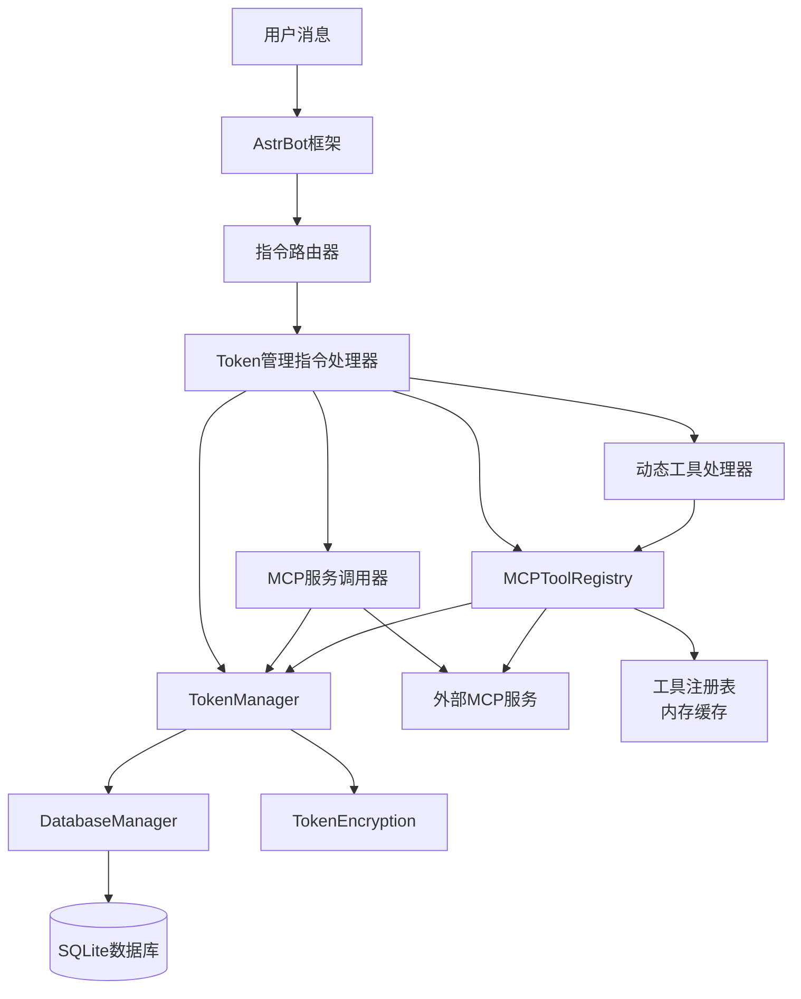
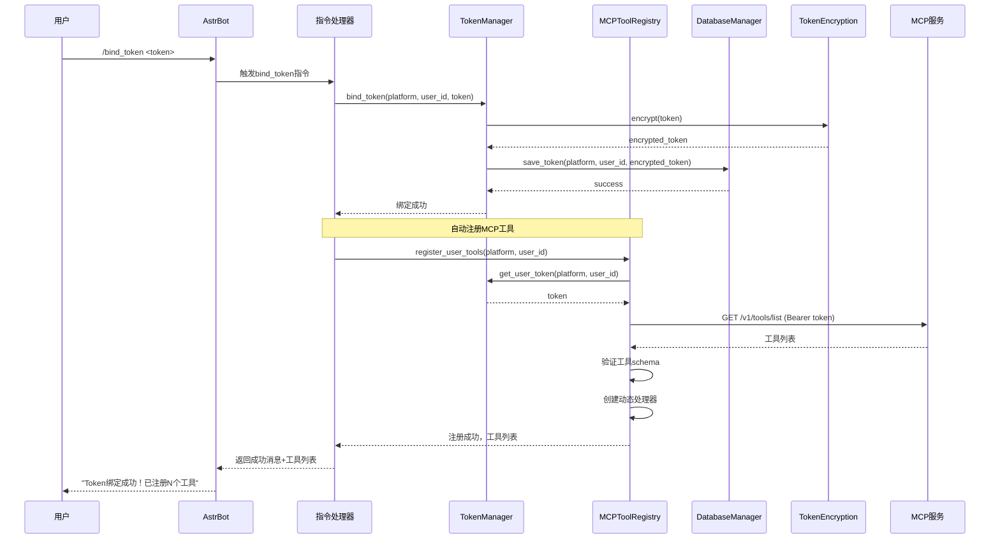
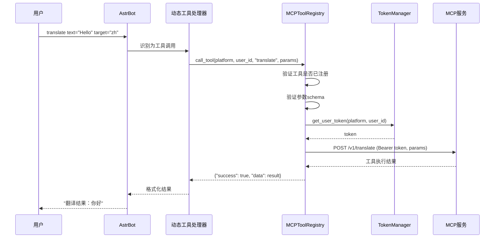
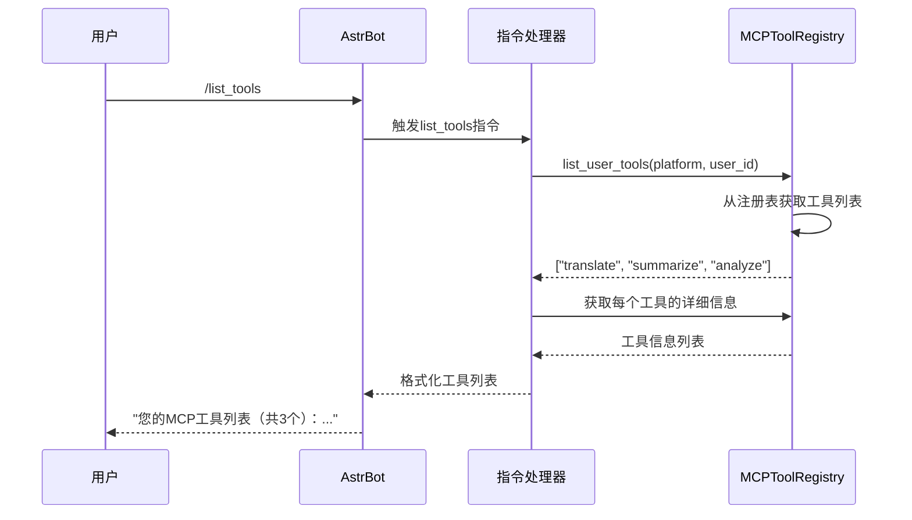

# 设计文档：用户Token管理系统

## 概述

为AstrBot插件开发一个用户token管理系统，允许每个聊天用户绑定自己的外部MCP服务token，并在调用外部MCP服务时使用用户专属的token。系统使用SQLite数据库持久化存储用户平台、用户ID和token的映射关系，确保token安全存储（加密）并提供完整的token生命周期管理（绑定、查询、更新、删除）。

核心功能包括：
1. 用户token绑定与管理（加密存储、更新、删除）
2. MCP工具自动发现与注册：用户绑定token后，系统自动从MCP服务器发现可用工具，并将这些工具动态注册到用户的聊天会话中
3. 工具隔离性：每个用户只能调用使用自己token授权的MCP工具，确保多用户环境下的安全性
4. 动态工具调用：用户可以直接调用已注册的MCP工具，就像使用插件的原生指令一样
5. 工具生命周期管理：token更新时自动重新注册工具，token解绑时自动取消工具注册

该系统集成到现有的AstrBot插件框架中，通过装饰器注册指令，使用异步事件处理模式，为用户提供简单易用的token管理和工具调用接口。

## 架构



## 主要工作流程

### 工作流程1: Token绑定与工具自动注册



### 工作流程2: MCP工具调用



### 工作流程3: 工具列表查询



## 组件和接口

### 组件 1: DatabaseManager

**目的**: 管理SQLite数据库连接和用户token数据的CRUD操作

**接口**:
```python
class DatabaseManager:
    def __init__(self, db_path: str):
        """初始化数据库管理器"""
        pass
    
    async def initialize(self) -> None:
        """创建数据库表结构"""
        pass
    
    async def save_token(self, platform: str, user_id: str, encrypted_token: str) -> bool:
        """保存或更新用户token"""
        pass
    
    async def get_token(self, platform: str, user_id: str) -> Optional[str]:
        """获取用户的加密token"""
        pass
    
    async def delete_token(self, platform: str, user_id: str) -> bool:
        """删除用户token"""
        pass
    
    async def user_has_token(self, platform: str, user_id: str) -> bool:
        """检查用户是否已绑定token"""
        pass
    
    async def close(self) -> None:
        """关闭数据库连接"""
        pass
```

**职责**:
- 管理SQLite数据库连接生命周期
- 执行用户token的增删改查操作
- 确保数据库操作的原子性和一致性
- 处理数据库异常和错误

### 组件 2: TokenEncryption

**目的**: 提供token的加密和解密功能，确保token安全存储

**接口**:
```python
class TokenEncryption:
    def __init__(self, encryption_key: Optional[bytes] = None):
        """初始化加密器，如果未提供密钥则生成新密钥"""
        pass
    
    def encrypt(self, token: str) -> str:
        """加密token，返回base64编码的加密字符串"""
        pass
    
    def decrypt(self, encrypted_token: str) -> str:
        """解密token，返回原始token字符串"""
        pass
    
    def get_key(self) -> bytes:
        """获取当前使用的加密密钥"""
        pass
```

**职责**:
- 使用Fernet对称加密算法加密token
- 解密存储的token用于MCP服务调用
- 管理加密密钥的生成和存储
- 处理加密/解密异常


### 组件 3: TokenManager

**目的**: 协调数据库管理和加密操作，提供高层token管理接口

**接口**:
```python
class TokenManager:
    def __init__(self, db_manager: DatabaseManager, encryption: TokenEncryption):
        """初始化token管理器"""
        pass
    
    async def bind_token(self, platform: str, user_id: str, token: str) -> bool:
        """绑定用户token（加密后存储）"""
        pass
    
    async def get_user_token(self, platform: str, user_id: str) -> Optional[str]:
        """获取用户token（解密后返回）"""
        pass
    
    async def update_token(self, platform: str, user_id: str, new_token: str) -> bool:
        """更新用户token"""
        pass
    
    async def unbind_token(self, platform: str, user_id: str) -> bool:
        """解绑用户token"""
        pass
    
    async def has_token(self, platform: str, user_id: str) -> bool:
        """检查用户是否已绑定token"""
        pass
```

**职责**:
- 协调DatabaseManager和TokenEncryption组件
- 提供业务层的token管理接口
- 处理token绑定、更新、删除的业务逻辑
- 验证输入参数的有效性

### 组件 4: MCPServiceCaller

**目的**: 使用用户token调用外部MCP服务

**接口**:
```python
class MCPServiceCaller:
    def __init__(self, token_manager: TokenManager):
        """初始化MCP服务调用器"""
        pass
    
    async def call_service(
        self, 
        platform: str, 
        user_id: str, 
        service_name: str, 
        **kwargs
    ) -> Dict[str, Any]:
        """使用用户token调用MCP服务"""
        pass
    
    async def validate_token(self, token: str) -> bool:
        """验证token是否有效"""
        pass
```

**职责**:
- 获取用户的token并调用外部MCP服务
- 处理MCP服务调用的HTTP请求
- 处理token无效或过期的情况
- 返回格式化的服务响应

### 组件 5: MCPToolRegistry

**目的**: 管理MCP工具的发现、注册和调用，实现工具的动态注册和用户隔离

**接口**:
```python
class MCPToolRegistry:
    def __init__(self, token_manager: TokenManager, mcp_config: MCPConfig):
        """初始化MCP工具注册表"""
        pass
    
    async def discover_tools(self, token: str) -> List[Dict[str, Any]]:
        """从MCP服务器发现可用工具
        
        Args:
            token: 用户的MCP token
            
        Returns:
            工具列表，每个工具包含: name, description, parameters, schema
        """
        pass
    
    async def register_user_tools(self, platform: str, user_id: str) -> bool:
        """为用户注册MCP工具到聊天会话
        
        Args:
            platform: 用户平台
            user_id: 用户ID
            
        Returns:
            注册是否成功
        """
        pass
    
    async def unregister_user_tools(self, platform: str, user_id: str) -> bool:
        """取消注册用户的MCP工具
        
        Args:
            platform: 用户平台
            user_id: 用户ID
            
        Returns:
            取消注册是否成功
        """
        pass
    
    async def call_tool(
        self, 
        platform: str, 
        user_id: str, 
        tool_name: str, 
        **params
    ) -> Dict[str, Any]:
        """调用用户的MCP工具
        
        Args:
            platform: 用户平台
            user_id: 用户ID
            tool_name: 工具名称
            **params: 工具参数
            
        Returns:
            工具执行结果
        """
        pass
    
    async def list_user_tools(self, platform: str, user_id: str) -> List[str]:
        """列出用户可用的MCP工具
        
        Args:
            platform: 用户平台
            user_id: 用户ID
            
        Returns:
            工具名称列表
        """
        pass
    
    def get_tool_info(self, platform: str, user_id: str, tool_name: str) -> Optional[Dict[str, Any]]:
        """获取工具的详细信息
        
        Args:
            platform: 用户平台
            user_id: 用户ID
            tool_name: 工具名称
            
        Returns:
            工具信息（包含描述、参数schema等）
        """
        pass
```

**职责**:
- 从MCP服务器发现可用工具列表
- 为每个用户维护独立的工具注册表
- 动态创建工具处理器并绑定到用户会话
- 调用工具时自动使用用户的token进行认证
- 确保工具隔离性（用户只能调用自己的工具）
- 管理工具的生命周期（注册、更新、注销）

### 组件 6: CommandHandlers

**目的**: 处理用户指令，提供token管理和工具调用的用户界面

**接口**:
```python
class TokenManagementPlugin(Star):
    @filter.command("bind_token")
    async def bind_token_command(self, event: AstrMessageEvent) -> MessageEventResult:
        """绑定token指令: /bind_token <token>
        
        成功后自动注册MCP工具到用户会话
        """
        pass
    
    @filter.command("unbind_token")
    async def unbind_token_command(self, event: AstrMessageEvent) -> MessageEventResult:
        """解绑token指令: /unbind_token
        
        同时取消注册用户的所有MCP工具
        """
        pass
    
    @filter.command("check_token")
    async def check_token_command(self, event: AstrMessageEvent) -> MessageEventResult:
        """检查token状态指令: /check_token"""
        pass
    
    @filter.command("update_token")
    async def update_token_command(self, event: AstrMessageEvent) -> MessageEventResult:
        """更新token指令: /update_token <new_token>
        
        更新后重新注册MCP工具
        """
        pass
    
    @filter.command("list_tools")
    async def list_tools_command(self, event: AstrMessageEvent) -> MessageEventResult:
        """列出当前用户可用的MCP工具: /list_tools"""
        pass
    
    @filter.command("tool_info")
    async def tool_info_command(self, event: AstrMessageEvent) -> MessageEventResult:
        """查看工具详细信息: /tool_info <tool_name>"""
        pass
    
    @filter.command("call_mcp")
    async def call_mcp_command(self, event: AstrMessageEvent) -> MessageEventResult:
        """调用MCP服务指令: /call_mcp <service_name> [args]
        
        已废弃，建议直接使用注册的工具名称调用
        """
        pass
    
    async def handle_dynamic_tool_call(self, event: AstrMessageEvent, tool_name: str) -> MessageEventResult:
        """处理动态注册的工具调用
        
        当用户发送消息时，检查是否匹配已注册的工具名称
        如果匹配，则调用对应的MCP工具
        """
        pass
```

**职责**:
- 解析用户指令和参数
- 在token绑定成功后自动触发工具注册
- 在token解绑或更新时管理工具的注册状态
- 提供工具列表和详细信息查询
- 处理动态工具调用请求
- 格式化响应消息返回给用户
- 处理错误并提供友好的错误提示

### 组件 7: MCPConfig

**目的**: 管理MCP服务器配置，提供服务端点URL和连接参数

**接口**:
```python
class MCPConfig:
    """MCP服务器配置管理器"""
    
    def __init__(self, config_file: Optional[str] = None):
        """初始化配置管理器，可选从配置文件加载"""
        pass
    
    def get_service_url(self, service_name: str) -> str:
        """获取指定服务的完整URL"""
        pass
    
    def get_base_url(self) -> str:
        """获取MCP服务器基础URL"""
        pass
    
    def get_timeout(self) -> int:
        """获取请求超时时间（秒）"""
        pass
    
    def get_max_retries(self) -> int:
        """获取最大重试次数"""
        pass
    
    def get_retry_delay(self) -> float:
        """获取重试延迟时间（秒）"""
        pass
    
    def validate(self) -> bool:
        """验证配置的有效性"""
        pass
    
    def reload(self) -> None:
        """重新加载配置（支持热更新）"""
        pass
    
    @classmethod
    def from_env(cls) -> "MCPConfig":
        """从环境变量创建配置"""
        pass
```

**职责**:
- 管理MCP服务器的基础URL和端点配置
- 支持多个MCP服务端点的映射
- 提供默认配置和环境变量覆盖机制
- 管理连接参数（超时、重试等）
- 验证配置的完整性和有效性
- 支持配置热更新


## 数据模型

### 数据库表: user_tokens

```python
# SQLite表结构
CREATE TABLE IF NOT EXISTS user_tokens (
    id INTEGER PRIMARY KEY AUTOINCREMENT,
    platform TEXT NOT NULL,
    user_id TEXT NOT NULL,
    encrypted_token TEXT NOT NULL,
    created_at TIMESTAMP DEFAULT CURRENT_TIMESTAMP,
    updated_at TIMESTAMP DEFAULT CURRENT_TIMESTAMP,
    UNIQUE(platform, user_id)
)
```

**字段说明**:
- `id`: 自增主键
- `platform`: 用户所在平台（如：qq, telegram, discord等）
- `user_id`: 用户在该平台的唯一标识
- `encrypted_token`: 加密后的MCP服务token
- `created_at`: token首次绑定时间
- `updated_at`: token最后更新时间

**验证规则**:
- `platform` 不能为空，长度限制1-50字符
- `user_id` 不能为空，长度限制1-100字符
- `encrypted_token` 不能为空
- `(platform, user_id)` 组合必须唯一

### 配置模型: EncryptionConfig

```python
from dataclasses import dataclass

@dataclass
class EncryptionConfig:
    """加密配置"""
    key_file_path: str = "/AstrBot/data/encryption.key"
    algorithm: str = "Fernet"
```

**字段说明**:
- `key_file_path`: 加密密钥文件存储路径
- `algorithm`: 加密算法（默认使用Fernet对称加密）

### 配置模型: DatabaseConfig

```python
from dataclasses import dataclass

@dataclass
class DatabaseConfig:
    """数据库配置"""
    db_path: str = "/AstrBot/data/user_tokens.db"
    connection_timeout: int = 10
```

**字段说明**:
- `db_path`: SQLite数据库文件路径
- `connection_timeout`: 数据库连接超时时间（秒）

### 数据模型: MCPTool

```python
from dataclasses import dataclass
from typing import Dict, Any, List

@dataclass
class MCPTool:
    """MCP工具数据模型"""
    name: str                           # 工具名称
    description: str                    # 工具描述
    parameters: Dict[str, Any]          # 参数schema（JSON Schema格式）
    endpoint: str                       # 工具对应的API端点
    method: str = "POST"                # HTTP方法
    
    def to_dict(self) -> Dict[str, Any]:
        """转换为字典格式"""
        return {
            "name": self.name,
            "description": self.description,
            "parameters": self.parameters,
            "endpoint": self.endpoint,
            "method": self.method
        }
    
    @classmethod
    def from_dict(cls, data: Dict[str, Any]) -> "MCPTool":
        """从字典创建工具实例"""
        return cls(
            name=data["name"],
            description=data["description"],
            parameters=data["parameters"],
            endpoint=data["endpoint"],
            method=data.get("method", "POST")
        )
    
    def validate_params(self, params: Dict[str, Any]) -> bool:
        """验证参数是否符合schema"""
        # 简化版本：检查必需参数是否存在
        required = self.parameters.get("required", [])
        return all(param in params for param in required)
```

**字段说明**:
- `name`: 工具的唯一标识名称
- `description`: 工具的功能描述
- `parameters`: JSON Schema格式的参数定义
- `endpoint`: 工具对应的MCP服务API端点
- `method`: HTTP请求方法（默认POST）

### 数据库表: user_tools (可选)

```python
# SQLite表结构（可选：用于持久化工具注册信息）
CREATE TABLE IF NOT EXISTS user_tools (
    id INTEGER PRIMARY KEY AUTOINCREMENT,
    platform TEXT NOT NULL,
    user_id TEXT NOT NULL,
    tool_name TEXT NOT NULL,
    tool_data TEXT NOT NULL,  -- JSON格式的工具信息
    registered_at TIMESTAMP DEFAULT CURRENT_TIMESTAMP,
    UNIQUE(platform, user_id, tool_name),
    FOREIGN KEY(platform, user_id) REFERENCES user_tokens(platform, user_id)
)
```

**字段说明**:
- `id`: 自增主键
- `platform`: 用户所在平台
- `user_id`: 用户ID
- `tool_name`: 工具名称
- `tool_data`: JSON格式的工具详细信息（MCPTool序列化）
- `registered_at`: 工具注册时间

**验证规则**:
- `(platform, user_id, tool_name)` 组合必须唯一
- `tool_data` 必须是有效的JSON字符串
- 外键约束确保工具属于已绑定token的用户

**注意**: 此表为可选实现，也可以使用内存缓存（如字典）存储工具注册信息

### 配置模型: MCPServiceConfig

```python
from dataclasses import dataclass
from typing import Dict, Optional
import os

@dataclass
class MCPServiceConfig:
    """MCP服务配置"""
    # 基础URL配置
    base_url: str = "https://api.mcp-service.example.com"
    
    # 服务端点映射
    service_endpoints: Dict[str, str] = None
    
    # 连接参数
    timeout: int = 30
    max_retries: int = 3
    retry_delay: float = 1.0
    
    # SSL验证
    verify_ssl: bool = True
    
    def __post_init__(self):
        """初始化后处理，支持环境变量覆盖"""
        # 从环境变量覆盖基础URL
        self.base_url = os.getenv("MCP_BASE_URL", self.base_url)
        
        # 从环境变量覆盖超时设置
        if os.getenv("MCP_TIMEOUT"):
            self.timeout = int(os.getenv("MCP_TIMEOUT"))
        
        # 从环境变量覆盖重试次数
        if os.getenv("MCP_MAX_RETRIES"):
            self.max_retries = int(os.getenv("MCP_MAX_RETRIES"))
        
        # 初始化默认服务端点
        if self.service_endpoints is None:
            self.service_endpoints = {
                "translate": "/v1/translate",
                "summarize": "/v1/summarize",
                "analyze": "/v1/analyze",
                "generate": "/v1/generate",
            }
    
    def get_service_url(self, service_name: str) -> str:
        """获取完整的服务URL"""
        endpoint = self.service_endpoints.get(service_name)
        if endpoint is None:
            raise ValueError(f"未知的服务名称: {service_name}")
        return f"{self.base_url.rstrip('/')}{endpoint}"
    
    def validate(self) -> bool:
        """验证配置有效性"""
        if not self.base_url:
            return False
        if self.timeout <= 0:
            return False
        if self.max_retries < 0:
            return False
        if self.retry_delay < 0:
            return False
        return True
```

**字段说明**:
- `base_url`: MCP服务器基础URL（支持环境变量 `MCP_BASE_URL` 覆盖）
- `service_endpoints`: 服务名称到端点路径的映射字典
- `timeout`: HTTP请求超时时间（秒，支持环境变量 `MCP_TIMEOUT` 覆盖）
- `max_retries`: 请求失败时的最大重试次数（支持环境变量 `MCP_MAX_RETRIES` 覆盖）
- `retry_delay`: 重试之间的延迟时间（秒）
- `verify_ssl`: 是否验证SSL证书

**环境变量支持**:
- `MCP_BASE_URL`: 覆盖默认的MCP服务器地址
- `MCP_TIMEOUT`: 覆盖默认的超时时间
- `MCP_MAX_RETRIES`: 覆盖默认的重试次数

## 核心函数的形式化规范

### 函数 1: bind_token()

```python
async def bind_token(self, platform: str, user_id: str, token: str) -> bool:
    """绑定用户token"""
    pass
```

**前置条件**:
- `platform` 非空且长度在1-50字符之间
- `user_id` 非空且长度在1-100字符之间
- `token` 非空字符串
- 数据库连接已建立

**后置条件**:
- 返回 `True` 当且仅当token成功加密并存储到数据库
- 如果用户已有token，则更新现有记录
- 数据库中存在 `(platform, user_id)` 对应的加密token记录
- `updated_at` 字段更新为当前时间
- 发生错误时返回 `False`，不修改数据库状态

**循环不变式**: 不适用（无循环）

### 函数 2: get_user_token()

```python
async def get_user_token(self, platform: str, user_id: str) -> Optional[str]:
    """获取用户token（解密后）"""
    pass
```

**前置条件**:
- `platform` 非空字符串
- `user_id` 非空字符串
- 数据库连接已建立
- 加密密钥可用

**后置条件**:
- 返回解密后的token字符串，如果用户已绑定token
- 返回 `None`，如果用户未绑定token
- 不修改数据库状态
- 解密失败时抛出异常

**循环不变式**: 不适用（无循环）


### 函数 3: call_service()

```python
async def call_service(
    self, 
    platform: str, 
    user_id: str, 
    service_name: str, 
    **kwargs
) -> Dict[str, Any]:
    """使用用户token调用MCP服务"""
    pass
```

**前置条件**:
- `platform` 和 `user_id` 非空字符串
- `service_name` 是有效的MCP服务名称
- 用户已绑定有效的token
- MCP服务端点可访问

**后置条件**:
- 返回包含服务响应的字典，如果调用成功
- 返回包含错误信息的字典，如果调用失败
- 字典必须包含 `success` 键（布尔值）
- 成功时包含 `data` 键，失败时包含 `error` 键
- 不修改用户token

**循环不变式**: 不适用（无循环）

### 函数 4: encrypt()

```python
def encrypt(self, token: str) -> str:
    """加密token"""
    pass
```

**前置条件**:
- `token` 是非空字符串
- 加密密钥已初始化

**后置条件**:
- 返回base64编码的加密字符串
- 加密结果可以被 `decrypt()` 函数还原
- 相同输入产生不同输出（包含随机IV）
- 加密过程不修改原始token

**循环不变式**: 不适用（无循环）

## 算法伪代码

### 主算法: Token绑定流程

```python
async def bind_token_workflow(platform: str, user_id: str, token: str) -> bool:
    """
    输入: platform (用户平台), user_id (用户ID), token (原始token)
    输出: bool (绑定是否成功)
    """
    # 前置条件断言
    assert platform and len(platform) <= 50
    assert user_id and len(user_id) <= 100
    assert token and len(token) > 0
    
    # 步骤 1: 验证输入参数
    if not validate_input(platform, user_id, token):
        return False
    
    # 步骤 2: 加密token
    try:
        encrypted_token = encryption.encrypt(token)
    except Exception as e:
        logger.error(f"Token加密失败: {e}")
        return False
    
    # 步骤 3: 保存到数据库
    try:
        success = await db_manager.save_token(platform, user_id, encrypted_token)
        assert success implies database_has_record(platform, user_id)
        return success
    except Exception as e:
        logger.error(f"数据库保存失败: {e}")
        return False
```

**前置条件**:
- 输入参数已验证
- 数据库和加密组件已初始化

**后置条件**:
- 返回 `True` 当且仅当token成功存储
- 数据库状态一致（要么完全成功，要么完全回滚）

**循环不变式**: 不适用（无循环）

### 算法: MCP服务调用流程

```python
async def call_mcp_service_workflow(
    platform: str, 
    user_id: str, 
    service_name: str,
    params: Dict[str, Any]
) -> Dict[str, Any]:
    """
    输入: platform, user_id, service_name, params
    输出: Dict[str, Any] (服务响应)
    """
    # 步骤 1: 获取用户token
    token = await token_manager.get_user_token(platform, user_id)
    
    if token is None:
        return {
            "success": False,
            "error": "用户未绑定token，请先使用 /bind_token 绑定"
        }
    
    # 步骤 2: 构建MCP服务请求
    headers = {
        "Authorization": f"Bearer {token}",
        "Content-Type": "application/json"
    }
    
    # 步骤 3: 调用MCP服务
    try:
        async with aiohttp.ClientSession() as session:
            async with session.post(
                f"{MCP_BASE_URL}/{service_name}",
                headers=headers,
                json=params,
                timeout=aiohttp.ClientTimeout(total=30)
            ) as response:
                if response.status == 200:
                    data = await response.json()
                    return {"success": True, "data": data}
                elif response.status == 401:
                    return {
                        "success": False,
                        "error": "Token无效或已过期，请更新token"
                    }
                else:
                    return {
                        "success": False,
                        "error": f"服务调用失败: HTTP {response.status}"
                    }
    except asyncio.TimeoutError:
        return {"success": False, "error": "服务调用超时"}
    except Exception as e:
        logger.error(f"MCP服务调用异常: {e}")
        return {"success": False, "error": f"调用异常: {str(e)}"}
```

**前置条件**:
- `platform`, `user_id`, `service_name` 非空
- `params` 是有效的字典
- 网络连接可用

**后置条件**:
- 返回字典包含 `success` 键
- 成功时包含 `data`，失败时包含 `error`
- 不修改用户token或数据库状态

**循环不变式**: 不适用（无循环）


### 算法: 数据库初始化

```python
async def initialize_database() -> None:
    """
    输入: 无
    输出: 无（副作用：创建数据库表）
    """
    # 步骤 1: 创建数据目录
    data_dir = Path("/AstrBot/data")
    if not data_dir.exists():
        data_dir.mkdir(parents=True)
    
    # 步骤 2: 连接数据库
    conn = await aiosqlite.connect(db_path)
    
    # 步骤 3: 创建表结构
    await conn.execute("""
        CREATE TABLE IF NOT EXISTS user_tokens (
            id INTEGER PRIMARY KEY AUTOINCREMENT,
            platform TEXT NOT NULL,
            user_id TEXT NOT NULL,
            encrypted_token TEXT NOT NULL,
            created_at TIMESTAMP DEFAULT CURRENT_TIMESTAMP,
            updated_at TIMESTAMP DEFAULT CURRENT_TIMESTAMP,
            UNIQUE(platform, user_id)
        )
    """)
    
    # 步骤 4: 创建索引以优化查询
    await conn.execute("""
        CREATE INDEX IF NOT EXISTS idx_platform_user 
        ON user_tokens(platform, user_id)
    """)
    
    await conn.commit()
    await conn.close()
    
    # 后置条件断言
    assert table_exists("user_tokens")
    assert index_exists("idx_platform_user")
```

**前置条件**:
- 文件系统可写
- SQLite库可用

**后置条件**:
- `user_tokens` 表存在
- 索引 `idx_platform_user` 存在
- 数据库文件已创建

**循环不变式**: 不适用（无循环）

### 算法: 工具发现流程

```python
async def discover_tools_workflow(token: str) -> List[Dict[str, Any]]:
    """
    输入: token (用户的MCP token)
    输出: List[Dict[str, Any]] (工具列表)
    """
    # 前置条件断言
    assert token and len(token) > 0
    
    # 步骤 1: 构建工具发现请求
    headers = {
        "Authorization": f"Bearer {token}",
        "Content-Type": "application/json"
    }
    
    tools_endpoint = f"{mcp_config.base_url}/v1/tools/list"
    
    # 步骤 2: 调用MCP服务器获取工具列表
    try:
        async with aiohttp.ClientSession() as session:
            async with session.get(
                tools_endpoint,
                headers=headers,
                timeout=aiohttp.ClientTimeout(total=mcp_config.timeout)
            ) as response:
                if response.status == 200:
                    data = await response.json()
                    tools = data.get("tools", [])
                    
                    # 步骤 3: 验证工具数据格式
                    validated_tools = []
                    for tool in tools:
                        if validate_tool_schema(tool):
                            validated_tools.append(tool)
                        else:
                            logger.warning(f"工具schema验证失败: {tool.get('name')}")
                    
                    return validated_tools
                elif response.status == 401:
                    logger.error("Token无效，无法发现工具")
                    return []
                else:
                    logger.error(f"工具发现失败: HTTP {response.status}")
                    return []
    except asyncio.TimeoutError:
        logger.error("工具发现请求超时")
        return []
    except Exception as e:
        logger.error(f"工具发现异常: {e}")
        return []
```

**前置条件**:
- `token` 非空字符串
- MCP服务器可访问
- 网络连接可用

**后置条件**:
- 返回工具列表（可能为空）
- 每个工具包含必需字段：name, description, parameters, endpoint
- 所有工具已通过schema验证
- 不修改任何状态

**循环不变式**:
- 在工具验证循环中：所有已添加到 `validated_tools` 的工具都通过了schema验证

### 算法: 工具注册流程

```python
async def register_tools_workflow(platform: str, user_id: str) -> bool:
    """
    输入: platform (用户平台), user_id (用户ID)
    输出: bool (注册是否成功)
    """
    # 前置条件断言
    assert platform and user_id
    
    # 步骤 1: 获取用户token
    token = await token_manager.get_user_token(platform, user_id)
    if token is None:
        logger.error(f"用户 {platform}:{user_id} 未绑定token")
        return False
    
    # 步骤 2: 发现可用工具
    tools = await discover_tools_workflow(token)
    if not tools:
        logger.warning(f"用户 {platform}:{user_id} 未发现任何工具")
        return False
    
    # 步骤 3: 为用户注册工具
    user_key = f"{platform}:{user_id}"
    tool_registry[user_key] = {}
    
    for tool_data in tools:
        tool = MCPTool.from_dict(tool_data)
        tool_registry[user_key][tool.name] = tool
        
        # 步骤 4: 创建动态工具处理器
        create_dynamic_tool_handler(platform, user_id, tool)
    
    logger.info(f"为用户 {user_key} 注册了 {len(tools)} 个工具")
    
    # 后置条件断言
    assert user_key in tool_registry
    assert len(tool_registry[user_key]) == len(tools)
    
    return True
```

**前置条件**:
- 用户已绑定有效token
- MCP服务器可访问
- `tool_registry` 已初始化

**后置条件**:
- 返回 `True` 当且仅当至少注册了一个工具
- `tool_registry[user_key]` 包含所有发现的工具
- 每个工具都有对应的动态处理器
- 失败时返回 `False`，不修改注册表

**循环不变式**:
- 在工具注册循环中：所有已处理的工具都已添加到 `tool_registry[user_key]`

### 算法: 工具调用流程

```python
async def call_tool_workflow(
    platform: str,
    user_id: str,
    tool_name: str,
    params: Dict[str, Any]
) -> Dict[str, Any]:
    """
    输入: platform, user_id, tool_name, params
    输出: Dict[str, Any] (工具执行结果)
    """
    # 步骤 1: 验证用户是否有此工具
    user_key = f"{platform}:{user_id}"
    
    if user_key not in tool_registry:
        return {
            "success": False,
            "error": "用户未注册任何工具，请先绑定token"
        }
    
    tool = tool_registry[user_key].get(tool_name)
    if tool is None:
        return {
            "success": False,
            "error": f"工具 '{tool_name}' 不存在或未注册"
        }
    
    # 步骤 2: 验证参数
    if not tool.validate_params(params):
        return {
            "success": False,
            "error": f"参数验证失败，请检查必需参数"
        }
    
    # 步骤 3: 获取用户token
    token = await token_manager.get_user_token(platform, user_id)
    if token is None:
        return {
            "success": False,
            "error": "Token已失效，请重新绑定"
        }
    
    # 步骤 4: 构建工具调用请求
    headers = {
        "Authorization": f"Bearer {token}",
        "Content-Type": "application/json"
    }
    
    tool_url = f"{mcp_config.base_url}{tool.endpoint}"
    
    # 步骤 5: 调用MCP工具
    try:
        async with aiohttp.ClientSession() as session:
            async with session.request(
                tool.method,
                tool_url,
                headers=headers,
                json=params,
                timeout=aiohttp.ClientTimeout(total=mcp_config.timeout)
            ) as response:
                if response.status == 200:
                    data = await response.json()
                    return {
                        "success": True,
                        "data": data,
                        "tool": tool_name
                    }
                elif response.status == 401:
                    return {
                        "success": False,
                        "error": "Token无效或已过期"
                    }
                else:
                    error_text = await response.text()
                    return {
                        "success": False,
                        "error": f"工具调用失败: HTTP {response.status}",
                        "details": error_text
                    }
    except asyncio.TimeoutError:
        return {"success": False, "error": "工具调用超时"}
    except Exception as e:
        logger.error(f"工具调用异常: {e}")
        return {"success": False, "error": f"调用异常: {str(e)}"}
```

**前置条件**:
- `platform`, `user_id`, `tool_name` 非空
- `params` 是有效字典
- 用户已注册工具

**后置条件**:
- 返回字典包含 `success` 键
- 成功时包含 `data` 和 `tool`，失败时包含 `error`
- 不修改工具注册状态或用户token

**循环不变式**: 不适用（无循环）

### 算法: Token绑定与工具自动注册流程

```python
async def bind_token_with_tools_workflow(
    platform: str,
    user_id: str,
    token: str
) -> Dict[str, Any]:
    """
    输入: platform, user_id, token
    输出: Dict[str, Any] (绑定结果和工具信息)
    """
    # 步骤 1: 绑定token
    success = await token_manager.bind_token(platform, user_id, token)
    
    if not success:
        return {
            "success": False,
            "error": "Token绑定失败"
        }
    
    # 步骤 2: 自动注册工具
    tools_registered = await tool_registry.register_user_tools(platform, user_id)
    
    if not tools_registered:
        return {
            "success": True,
            "warning": "Token绑定成功，但未发现可用工具",
            "tools_count": 0
        }
    
    # 步骤 3: 获取已注册工具列表
    tool_names = await tool_registry.list_user_tools(platform, user_id)
    
    return {
        "success": True,
        "message": "Token绑定成功，工具已自动注册",
        "tools_count": len(tool_names),
        "tools": tool_names
    }
```

**前置条件**:
- 输入参数已验证
- TokenManager和MCPToolRegistry已初始化

**后置条件**:
- Token成功绑定到数据库
- 工具已注册到用户会话（如果发现了工具）
- 返回包含工具信息的结果字典

**循环不变式**: 不适用（无循环）

## 示例用法

### 示例 1: 用户绑定token并自动注册工具

```python
# 用户发送指令: /bind_token sk-abc123xyz456

# 插件处理流程
@filter.command("bind_token")
async def bind_token_command(self, event: AstrMessageEvent):
    # 解析参数
    message_parts = event.message_str.split(maxsplit=1)
    if len(message_parts) < 2:
        yield event.plain_result("❌ 用法: /bind_token <your_token>")
        return
    
    token = message_parts[1].strip()
    
    # 获取用户信息
    platform = event.get_platform_name()  # 例如: "qq"
    user_id = event.get_sender_id()       # 例如: "123456789"
    
    # 绑定token
    success = await self.token_manager.bind_token(platform, user_id, token)
    
    if not success:
        yield event.plain_result("❌ Token绑定失败，请稍后重试")
        return
    
    # 自动注册MCP工具
    tools_registered = await self.tool_registry.register_user_tools(platform, user_id)
    
    if tools_registered:
        tool_names = await self.tool_registry.list_user_tools(platform, user_id)
        tools_list = "\n".join([f"  • {name}" for name in tool_names])
        yield event.plain_result(
            f"✅ Token绑定成功！\n"
            f"🔧 已自动注册 {len(tool_names)} 个MCP工具：\n{tools_list}\n\n"
            f"使用 /list_tools 查看工具列表\n"
            f"使用 /tool_info <工具名> 查看工具详情"
        )
    else:
        yield event.plain_result(
            "✅ Token绑定成功！\n"
            "⚠️ 未发现可用的MCP工具"
        )
```

### 示例 2: 列出用户可用的MCP工具

```python
# 用户发送指令: /list_tools

@filter.command("list_tools")
async def list_tools_command(self, event: AstrMessageEvent):
    platform = event.get_platform_name()
    user_id = event.get_sender_id()
    
    # 获取用户工具列表
    tool_names = await self.tool_registry.list_user_tools(platform, user_id)
    
    if not tool_names:
        yield event.plain_result(
            "❌ 您还没有可用的MCP工具\n"
            "请先使用 /bind_token <token> 绑定您的token"
        )
        return
    
    # 格式化工具列表
    tools_info = []
    for tool_name in tool_names:
        tool = self.tool_registry.get_tool_info(platform, user_id, tool_name)
        if tool:
            tools_info.append(f"🔧 {tool_name}\n   {tool['description']}")
    
    result = f"📋 您的MCP工具列表（共 {len(tool_names)} 个）：\n\n"
    result += "\n\n".join(tools_info)
    result += "\n\n使用 /tool_info <工具名> 查看详细信息"
    
    yield event.plain_result(result)
```

### 示例 3: 查看工具详细信息

```python
# 用户发送指令: /tool_info translate

@filter.command("tool_info")
async def tool_info_command(self, event: AstrMessageEvent):
    message_parts = event.message_str.split(maxsplit=1)
    if len(message_parts) < 2:
        yield event.plain_result("❌ 用法: /tool_info <tool_name>")
        return
    
    tool_name = message_parts[1].strip()
    platform = event.get_platform_name()
    user_id = event.get_sender_id()
    
    # 获取工具信息
    tool_info = self.tool_registry.get_tool_info(platform, user_id, tool_name)
    
    if not tool_info:
        yield event.plain_result(f"❌ 工具 '{tool_name}' 不存在或未注册")
        return
    
    # 格式化参数信息
    params = tool_info.get("parameters", {})
    required = params.get("required", [])
    properties = params.get("properties", {})
    
    params_info = []
    for param_name, param_schema in properties.items():
        is_required = "必需" if param_name in required else "可选"
        param_type = param_schema.get("type", "any")
        param_desc = param_schema.get("description", "无描述")
        params_info.append(f"  • {param_name} ({param_type}, {is_required}): {param_desc}")
    
    result = f"🔧 工具信息: {tool_name}\n\n"
    result += f"📝 描述: {tool_info['description']}\n\n"
    result += f"📌 参数:\n" + "\n".join(params_info) if params_info else "  无参数"
    result += f"\n\n🌐 端点: {tool_info['endpoint']}"
    result += f"\n📡 方法: {tool_info.get('method', 'POST')}"
    
    yield event.plain_result(result)
```

### 示例 4: 调用MCP工具

```python
# 方式1: 通过AstrBot的自然语言理解（如果集成）
# 用户发送: "帮我翻译 Hello 到中文"
# 系统识别为调用 translate 工具

# 方式2: 直接调用工具（通过动态处理器）
# 用户发送: translate text="Hello" target="zh"

async def handle_message(self, event: AstrMessageEvent):
    """处理用户消息，检查是否为工具调用"""
    message = event.message_str.strip()
    platform = event.get_platform_name()
    user_id = event.get_sender_id()
    
    # 检查是否匹配工具调用格式: tool_name param1=value1 param2=value2
    parts = message.split(maxsplit=1)
    if len(parts) < 1:
        return
    
    potential_tool_name = parts[0]
    
    # 检查用户是否有此工具
    tool_names = await self.tool_registry.list_user_tools(platform, user_id)
    if potential_tool_name not in tool_names:
        return  # 不是工具调用，交给其他处理器
    
    # 解析参数
    params = {}
    if len(parts) > 1:
        params = parse_tool_params(parts[1])  # 解析 key=value 格式
    
    # 调用工具
    result = await self.tool_registry.call_tool(
        platform, user_id, potential_tool_name, **params
    )
    
    if result["success"]:
        yield event.plain_result(
            f"✅ 工具 '{potential_tool_name}' 执行成功：\n"
            f"{format_tool_result(result['data'])}"
        )
    else:
        yield event.plain_result(
            f"❌ 工具执行失败: {result['error']}"
        )
```

### 示例 5: 更新token并重新注册工具

```python
# 用户发送指令: /update_token sk-new-token-xyz

@filter.command("update_token")
async def update_token_command(self, event: AstrMessageEvent):
    message_parts = event.message_str.split(maxsplit=1)
    if len(message_parts) < 2:
        yield event.plain_result("❌ 用法: /update_token <new_token>")
        return
    
    new_token = message_parts[1].strip()
    platform = event.get_platform_name()
    user_id = event.get_sender_id()
    
    # 先取消注册旧工具
    await self.tool_registry.unregister_user_tools(platform, user_id)
    
    # 更新token
    success = await self.token_manager.update_token(platform, user_id, new_token)
    
    if not success:
        yield event.plain_result("❌ Token更新失败")
        return
    
    # 重新注册工具
    tools_registered = await self.tool_registry.register_user_tools(platform, user_id)
    
    if tools_registered:
        tool_names = await self.tool_registry.list_user_tools(platform, user_id)
        yield event.plain_result(
            f"✅ Token更新成功！\n"
            f"🔧 已重新注册 {len(tool_names)} 个MCP工具"
        )
    else:
        yield event.plain_result(
            "✅ Token更新成功！\n"
            "⚠️ 未发现可用的MCP工具"
        )
```

### 示例 6: 解绑token并取消工具注册

```python
# 用户发送指令: /unbind_token

@filter.command("unbind_token")
async def unbind_token_command(self, event: AstrMessageEvent):
    platform = event.get_platform_name()
    user_id = event.get_sender_id()
    
    # 先取消注册工具
    await self.tool_registry.unregister_user_tools(platform, user_id)
    
    # 删除token
    success = await self.token_manager.unbind_token(platform, user_id)
    
    if success:
        yield event.plain_result(
            "✅ Token已解绑\n"
            "🔧 所有MCP工具已取消注册"
        )
    else:
        yield event.plain_result("❌ Token解绑失败")
```
```

### 示例 7: 使用MCP配置

```python
# 方式1: 使用默认配置
from mcp_config import MCPServiceConfig

config = MCPServiceConfig()
print(f"基础URL: {config.base_url}")
print(f"翻译服务URL: {config.get_service_url('translate')}")
# 输出: https://api.mcp-service.example.com/v1/translate

# 方式2: 自定义配置
config = MCPServiceConfig(
    base_url="https://custom-mcp.example.com",
    timeout=60,
    max_retries=5,
    service_endpoints={
        "translate": "/api/v2/translate",
        "custom_service": "/api/custom"
    }
)

# 方式3: 从环境变量加载
# 设置环境变量: export MCP_BASE_URL=https://prod-mcp.example.com
# 设置环境变量: export MCP_TIMEOUT=45
config = MCPServiceConfig()  # 自动从环境变量覆盖
print(f"基础URL: {config.base_url}")  # 输出环境变量中的值

# 验证配置
if config.validate():
    print("✅ 配置有效")
else:
    print("❌ 配置无效")

# 在MCPServiceCaller中使用配置
class MCPServiceCaller:
    def __init__(self, token_manager: TokenManager, config: MCPServiceConfig):
        self.token_manager = token_manager
        self.config = config
    
    async def call_service(
        self, 
        platform: str, 
        user_id: str, 
        service_name: str, 
        **kwargs
    ) -> Dict[str, Any]:
        """使用配置中的URL调用服务"""
        token = await self.token_manager.get_user_token(platform, user_id)
        if not token:
            return {"success": False, "error": "用户未绑定token"}
        
        # 获取服务URL
        service_url = self.config.get_service_url(service_name)
        
        headers = {
            "Authorization": f"Bearer {token}",
            "Content-Type": "application/json"
        }
        
        # 使用配置的超时和重试参数
        for attempt in range(self.config.max_retries + 1):
            try:
                async with aiohttp.ClientSession() as session:
                    async with session.post(
                        service_url,
                        headers=headers,
                        json=kwargs,
                        timeout=aiohttp.ClientTimeout(total=self.config.timeout),
                        ssl=self.config.verify_ssl
                    ) as response:
                        if response.status == 200:
                            data = await response.json()
                            return {"success": True, "data": data}
                        elif response.status == 401:
                            return {"success": False, "error": "Token无效或已过期"}
                        else:
                            return {"success": False, "error": f"HTTP {response.status}"}
            except asyncio.TimeoutError:
                if attempt < self.config.max_retries:
                    await asyncio.sleep(self.config.retry_delay)
                    continue
                return {"success": False, "error": "服务调用超时"}
            except Exception as e:
                if attempt < self.config.max_retries:
                    await asyncio.sleep(self.config.retry_delay)
                    continue
                return {"success": False, "error": f"调用异常: {str(e)}"}
```

### 示例 8: 完整工作流程（包含工具注册）

```python
# 初始化配置
mcp_config = MCPServiceConfig(
    base_url="https://api.mcp-service.example.com",
    timeout=30,
    max_retries=3
)

# 初始化插件
plugin = TokenManagementPlugin(context)
plugin.mcp_caller = MCPServiceCaller(plugin.token_manager, mcp_config)
plugin.tool_registry = MCPToolRegistry(plugin.token_manager, mcp_config)
await plugin.initialize()

# ========================================
# 场景1: 用户1绑定token并自动注册工具
# ========================================
result1 = await plugin.token_manager.bind_token("qq", "user001", "sk-token-user1")
assert result1 == True

# 自动发现并注册工具
tools_registered = await plugin.tool_registry.register_user_tools("qq", "user001")
assert tools_registered == True

# 查看已注册的工具
tools = await plugin.tool_registry.list_user_tools("qq", "user001")
print(f"用户1的工具: {tools}")
# 输出: ['translate', 'summarize', 'analyze']

# ========================================
# 场景2: 用户1调用MCP工具
# ========================================
# 调用翻译工具
result = await plugin.tool_registry.call_tool(
    "qq", "user001", "translate",
    text="Hello World",
    target="zh"
)
assert result["success"] == True
print(f"翻译结果: {result['data']}")

# 调用摘要工具
result = await plugin.tool_registry.call_tool(
    "qq", "user001", "summarize",
    text="Long article content...",
    max_length=100
)
assert result["success"] == True

# ========================================
# 场景3: 用户2绑定不同的token
# ========================================
await plugin.token_manager.bind_token("telegram", "user002", "sk-token-user2")
await plugin.tool_registry.register_user_tools("telegram", "user002")

# 用户2调用工具（使用user2的token）
result2 = await plugin.tool_registry.call_tool(
    "telegram", "user002", "translate",
    text="Bonjour",
    target="en"
)
# 使用的是user2的token，与user1完全隔离

# ========================================
# 场景4: 用户1更新token并重新注册工具
# ========================================
# 先取消注册旧工具
await plugin.tool_registry.unregister_user_tools("qq", "user001")

# 更新token
await plugin.token_manager.update_token("qq", "user001", "sk-new-token-user1")

# 重新注册工具（可能发现新的工具）
await plugin.tool_registry.register_user_tools("qq", "user001")

# ========================================
# 场景5: 用户2解绑token
# ========================================
# 取消注册工具
await plugin.tool_registry.unregister_user_tools("telegram", "user002")

# 删除token
await plugin.token_manager.unbind_token("telegram", "user002")

# 验证用户2无法再调用工具
result = await plugin.tool_registry.call_tool(
    "telegram", "user002", "translate",
    text="Test"
)
assert result["success"] == False
assert "未注册任何工具" in result["error"]

# ========================================
# 场景6: 查看工具详细信息
# ========================================
tool_info = plugin.tool_registry.get_tool_info("qq", "user001", "translate")
print(f"工具名称: {tool_info['name']}")
print(f"工具描述: {tool_info['description']}")
print(f"参数schema: {tool_info['parameters']}")
print(f"端点: {tool_info['endpoint']}")
```
```


## 正确性属性

*属性是一个特征或行为，应该在系统的所有有效执行中保持为真——本质上是关于系统应该做什么的形式化陈述。属性作为人类可读规范和机器可验证正确性保证之间的桥梁。*

### 属性 1: Token唯一性

*对于任意* 平台和用户ID组合，数据库中最多存在一条token记录

**验证需求：需求 11.2**

### 属性 2: 加密可逆性

*对于任意* token字符串，加密后解密必须得到原始token

**验证需求：需求 5.1**

### 属性 3: Token隔离性

*对于任意* 两个不同用户，调用MCP服务时必须使用各自的token，不会相互影响

**验证需求：需求 9.2, 9.3**

### 属性 4: 数据持久性

*对于任意* 成功绑定的token，系统重启后必须能够从数据库中恢复

**验证需求：需求 11.3**

### 属性 5: 操作原子性

*对于任意* token绑定操作，要么完全成功（token加密并存储），要么完全失败（数据库状态不变）

**验证需求：需求 1.5, 20.1, 20.3**

### 属性 6: Token访问控制

*对于任意* 未绑定token的用户，调用MCP服务必须失败并返回友好错误提示

**验证需求：需求 12.1**

### 属性 7: 工具注册一致性

*对于任意* 已绑定token的用户，其注册的工具必须是MCP服务器提供的工具的子集

**验证需求：需求 6.2, 6.3, 7.2**

### 属性 8: 工具调用隔离性

*对于任意* 两个不同用户，调用同名工具时必须使用各自的token，且结果互不影响

**验证需求：需求 9.1, 9.2, 9.5**

### 属性 9: 工具生命周期一致性

*对于任意* 用户，token绑定后自动注册工具，token解绑后自动取消注册所有工具

**验证需求：需求 1.2, 1.3, 4.1, 10.3**

### 属性 10: 工具调用前置条件

*对于任意* 工具调用请求，只有工具已注册且参数验证通过时才能执行

**验证需求：需求 8.1, 8.2, 18.1, 18.4**

### 属性 11: Token安全存储

*对于任意* 存储的token，数据库中只包含加密后的token，日志中不包含完整明文token

**验证需求：需求 5.3, 5.4, 15.5**

### 属性 12: 错误消息安全性

*对于任意* 错误响应，不得暴露系统内部实现细节或敏感信息

**验证需求：需求 12.5, 12.7**

### 属性 13: 工具更新一致性

*对于任意* token更新操作，必须先取消注册旧工具，更新token后重新注册新工具

**验证需求：需求 3.1, 3.2, 3.3, 10.1, 10.2**

### 属性 14: 参数验证完整性

*对于任意* 工具调用，必须验证所有必需参数存在且类型符合schema定义

**验证需求：需求 8.2, 18.1, 18.2, 18.5**

### 属性 15: 日志记录完整性

*对于任意* token管理操作（绑定、更新、解绑）和工具操作（注册、调用），必须记录日志且使用适当的日志级别

**验证需求：需求 15.1, 15.2, 15.3, 15.4**

### 属性 16: 输入验证安全性

*对于任意* 用户输入，必须验证长度和格式，使用参数化查询防止SQL注入

**验证需求：需求 17.1, 17.2**

### 属性 17: 传输安全性

*对于任意* MCP服务调用，必须使用HTTPS且token通过Authorization头传输

**验证需求：需求 17.3, 17.5**

### 属性 18: 速率限制

*对于任意* 用户，token绑定频率不超过每分钟5次，MCP服务调用频率不超过每分钟20次

**验证需求：需求 17.6, 17.7**

## 错误处理

### 错误场景 1: 用户未绑定token

**条件**: 用户尝试调用MCP服务，但未绑定token

**响应**: 
- 返回友好的错误消息："用户未绑定token，请先使用 /bind_token 绑定"
- 不执行MCP服务调用
- 记录日志（INFO级别）

**恢复**: 
- 提示用户使用 `/bind_token <token>` 指令绑定token
- 系统状态不变

### 错误场景 2: Token解密失败

**条件**: 数据库中的加密token无法被解密（密钥丢失或损坏）

**响应**:
- 抛出 `DecryptionError` 异常
- 返回错误消息："Token解密失败，请重新绑定token"
- 记录错误日志（ERROR级别）

**恢复**:
- 建议用户使用 `/update_token <new_token>` 重新绑定
- 可选：自动删除损坏的token记录

### 错误场景 3: MCP服务调用失败

**条件**: HTTP请求失败、超时或返回错误状态码

**响应**:
- 返回具体的错误信息（HTTP状态码、超时、网络错误等）
- 不修改用户token
- 记录详细错误日志（ERROR级别）

**恢复**:
- 对于401错误：提示用户token可能已过期，建议更新
- 对于超时：提示用户稍后重试
- 对于其他错误：显示具体错误信息

### 错误场景 4: 数据库连接失败

**条件**: 无法连接到SQLite数据库或执行SQL操作失败

**响应**:
- 抛出 `DatabaseError` 异常
- 返回错误消息："数据库操作失败，请联系管理员"
- 记录详细错误日志（CRITICAL级别）

**恢复**:
- 尝试重新连接数据库（最多3次）
- 如果持续失败，禁用token管理功能
- 通知管理员检查数据库文件和权限

### 错误场景 5: 无效的指令参数

**条件**: 用户提供的指令参数格式错误或缺失

**响应**:
- 返回用法提示："❌ 用法: /bind_token <your_token>"
- 不执行任何操作
- 记录日志（DEBUG级别）

**恢复**:
- 显示正确的指令格式和示例
- 系统状态不变

### 错误场景 6: 工具发现失败

**条件**: 从MCP服务器发现工具时失败（网络错误、token无效、服务器错误）

**响应**:
- Token绑定成功，但工具注册失败
- 返回警告消息："Token绑定成功，但未发现可用工具"
- 记录详细错误日志（WARNING级别）

**恢复**:
- 用户可以稍后使用 `/list_tools` 重试工具发现
- 或使用 `/update_token` 更新token后重新注册
- Token仍然有效，可用于直接调用MCP服务

### 错误场景 7: 工具不存在

**条件**: 用户尝试调用未注册或不存在的工具

**响应**:
- 返回错误消息："工具 'xxx' 不存在或未注册"
- 建议使用 `/list_tools` 查看可用工具
- 记录日志（INFO级别）

**恢复**:
- 提示用户查看可用工具列表
- 系统状态不变

### 错误场景 8: 工具参数验证失败

**条件**: 用户调用工具时提供的参数不符合工具的schema要求

**响应**:
- 返回错误消息："参数验证失败，请检查必需参数"
- 显示工具的参数要求（可选）
- 不执行工具调用
- 记录日志（INFO级别）

**恢复**:
- 提示用户使用 `/tool_info <tool_name>` 查看参数要求
- 提供正确的参数格式示例
- 系统状态不变

### 错误场景 9: 工具调用超时

**条件**: MCP工具调用超过配置的超时时间

**响应**:
- 返回错误消息："工具调用超时，请稍后重试"
- 不修改用户token或工具注册状态
- 记录详细错误日志（ERROR级别）

**恢复**:
- 建议用户稍后重试
- 如果持续超时，建议检查网络连接或联系管理员
- 系统状态不变

### 错误场景 10: 工具调用时token失效

**条件**: 工具调用时发现用户的token已失效或被撤销

**响应**:
- 返回错误消息："Token无效或已过期，请更新token"
- 不自动取消工具注册（保留工具列表）
- 记录日志（WARNING级别）

**恢复**:
- 提示用户使用 `/update_token <new_token>` 更新token
- 更新token后工具将自动可用
- 工具注册信息保留，无需重新发现


## 测试策略

### 单元测试方法

**DatabaseManager测试**:
- 测试数据库初始化和表创建
- 测试token的CRUD操作（创建、读取、更新、删除）
- 测试唯一约束（platform, user_id组合）
- 测试并发访问的线程安全性
- 测试异常处理（数据库锁、磁盘满等）

**TokenEncryption测试**:
- 测试加密和解密的正确性
- 测试加密的随机性（相同输入产生不同密文）
- 测试密钥生成和加载
- 测试无效密文的解密错误处理
- 测试空字符串和特殊字符的加密

**TokenManager测试**:
- 测试token绑定流程（加密+存储）
- 测试token获取流程（查询+解密）
- 测试token更新和删除
- 测试用户不存在的情况
- 测试组件协调逻辑

**MCPServiceCaller测试**:
- 测试成功的服务调用
- 测试HTTP错误响应（401, 404, 500等）
- 测试网络超时
- 测试无效token的处理
- 使用mock模拟外部MCP服务

**CommandHandlers测试**:
- 测试各个指令的参数解析
- 测试指令执行流程
- 测试错误消息格式
- 测试用户权限（如果需要）

**MCPToolRegistry测试**:
- 测试工具发现流程
- 测试工具注册和取消注册
- 测试工具调用流程
- 测试工具隔离性（不同用户的工具互不影响）
- 测试工具参数验证
- 测试工具信息查询
- 使用mock模拟MCP服务器的工具列表API

### 基于属性的测试方法

**属性测试库**: hypothesis (Python)

**属性测试 1: 加密可逆性**
```python
from hypothesis import given, strategies as st

@given(st.text(min_size=1))
def test_encryption_reversibility(token: str):
    """属性：任何token加密后都能正确解密"""
    encryption = TokenEncryption()
    encrypted = encryption.encrypt(token)
    decrypted = encryption.decrypt(encrypted)
    assert decrypted == token
```

**属性测试 2: Token唯一性**
```python
@given(
    st.text(min_size=1, max_size=50),  # platform
    st.text(min_size=1, max_size=100), # user_id
    st.text(min_size=1)                # token
)
async def test_token_uniqueness(platform: str, user_id: str, token: str):
    """属性：同一用户只能有一个token"""
    db = DatabaseManager("test.db")
    await db.initialize()
    
    # 绑定两次
    await db.save_token(platform, user_id, token)
    await db.save_token(platform, user_id, token + "_new")
    
    # 验证只有一条记录
    result = await db.get_token(platform, user_id)
    assert result == token + "_new"
    
    # 验证记录数量
    count = await db.count_tokens(platform, user_id)
    assert count == 1
```

**属性测试 3: 操作幂等性**
```python
@given(
    st.text(min_size=1, max_size=50),
    st.text(min_size=1, max_size=100),
    st.text(min_size=1)
)
async def test_bind_idempotency(platform: str, user_id: str, token: str):
    """属性：多次绑定相同token结果一致"""
    manager = TokenManager(db, encryption)
    
    result1 = await manager.bind_token(platform, user_id, token)
    result2 = await manager.bind_token(platform, user_id, token)
    
    assert result1 == result2 == True
    
    retrieved = await manager.get_user_token(platform, user_id)
    assert retrieved == token
```

**属性测试 4: Token隔离性**
```python
@given(
    st.text(min_size=1, max_size=50),
    st.text(min_size=1, max_size=100),
    st.text(min_size=1, max_size=100),
    st.text(min_size=1),
    st.text(min_size=1)
)
async def test_token_isolation(
    platform: str, 
    user_id1: str, 
    user_id2: str, 
    token1: str, 
    token2: str
):
    """属性：不同用户的token互不影响"""
    assume(user_id1 != user_id2)  # 确保是不同用户
    
    manager = TokenManager(db, encryption)
    
    await manager.bind_token(platform, user_id1, token1)
    await manager.bind_token(platform, user_id2, token2)
    
    retrieved1 = await manager.get_user_token(platform, user_id1)
    retrieved2 = await manager.get_user_token(platform, user_id2)
    
    assert retrieved1 == token1
    assert retrieved2 == token2
    assert retrieved1 != retrieved2
```

**属性测试 5: 工具注册一致性**
```python
@given(
    st.text(min_size=1, max_size=50),
    st.text(min_size=1, max_size=100),
    st.text(min_size=1)
)
async def test_tool_registration_consistency(
    platform: str,
    user_id: str,
    token: str
):
    """属性：工具注册后可以被查询到"""
    manager = TokenManager(db, encryption)
    registry = MCPToolRegistry(manager, mcp_config)
    
    # 绑定token
    await manager.bind_token(platform, user_id, token)
    
    # 注册工具（使用mock的工具列表）
    with mock_mcp_tools_api():
        success = await registry.register_user_tools(platform, user_id)
        
        if success:
            # 验证工具可以被查询
            tools = await registry.list_user_tools(platform, user_id)
            assert len(tools) > 0
            
            # 验证每个工具都有详细信息
            for tool_name in tools:
                tool_info = registry.get_tool_info(platform, user_id, tool_name)
                assert tool_info is not None
                assert "name" in tool_info
                assert "description" in tool_info
                assert "parameters" in tool_info
```

**属性测试 6: 工具调用隔离性**
```python
@given(
    st.text(min_size=1, max_size=50),
    st.text(min_size=1, max_size=100),
    st.text(min_size=1, max_size=100),
    st.text(min_size=1),
    st.text(min_size=1)
)
async def test_tool_call_isolation(
    platform: str,
    user_id1: str,
    user_id2: str,
    token1: str,
    token2: str
):
    """属性：不同用户调用工具使用各自的token"""
    assume(user_id1 != user_id2)
    
    manager = TokenManager(db, encryption)
    registry = MCPToolRegistry(manager, mcp_config)
    
    # 两个用户绑定不同token
    await manager.bind_token(platform, user_id1, token1)
    await manager.bind_token(platform, user_id2, token2)
    
    # 注册工具
    with mock_mcp_tools_api():
        await registry.register_user_tools(platform, user_id1)
        await registry.register_user_tools(platform, user_id2)
    
    # 调用工具并验证使用了正确的token
    with mock_mcp_tool_call() as mock_call:
        await registry.call_tool(platform, user_id1, "test_tool", param="value1")
        assert mock_call.last_token == token1
        
        await registry.call_tool(platform, user_id2, "test_tool", param="value2")
        assert mock_call.last_token == token2
```

**属性测试 7: 工具生命周期**
```python
@given(
    st.text(min_size=1, max_size=50),
    st.text(min_size=1, max_size=100),
    st.text(min_size=1)
)
async def test_tool_lifecycle(
    platform: str,
    user_id: str,
    token: str
):
    """属性：Token解绑后工具自动取消注册"""
    manager = TokenManager(db, encryption)
    registry = MCPToolRegistry(manager, mcp_config)
    
    # 绑定token并注册工具
    await manager.bind_token(platform, user_id, token)
    
    with mock_mcp_tools_api():
        await registry.register_user_tools(platform, user_id)
        tools_before = await registry.list_user_tools(platform, user_id)
        assert len(tools_before) > 0
    
    # 取消注册工具
    await registry.unregister_user_tools(platform, user_id)
    
    # 验证工具已清空
    tools_after = await registry.list_user_tools(platform, user_id)
    assert len(tools_after) == 0
    
    # 验证无法调用工具
    result = await registry.call_tool(platform, user_id, "test_tool")
    assert result["success"] == False
```

### 集成测试方法

**端到端测试场景**:
1. 完整的用户绑定流程测试
   - 模拟用户发送 `/bind_token` 指令
   - 验证token正确存储到数据库
   - 验证工具自动注册成功
   - 验证返回成功消息包含工具列表

2. 完整的MCP工具调用流程测试
   - 先绑定token并注册工具
   - 模拟用户调用工具
   - 使用mock MCP服务验证请求头包含正确token
   - 验证返回正确的工具执行结果

3. Token更新流程测试
   - 绑定初始token并注册工具
   - 更新为新token
   - 验证工具重新注册
   - 验证后续调用使用新token

4. 多用户并发测试
   - 多个用户同时绑定token
   - 多个用户同时注册工具
   - 多个用户同时调用工具
   - 验证token和工具不会混淆

5. 工具列表查询测试
   - 用户绑定token后查询工具列表
   - 验证返回正确的工具信息
   - 查询工具详细信息
   - 验证参数schema正确

6. 工具调用参数验证测试
   - 使用正确参数调用工具（成功）
   - 使用缺少必需参数调用工具（失败）
   - 使用错误类型参数调用工具（失败）
   - 验证错误消息清晰明确

7. Token解绑与工具清理测试
   - 用户绑定token并注册工具
   - 用户解绑token
   - 验证工具自动取消注册
   - 验证无法再调用工具

**测试环境配置**:
- 使用临时数据库文件（测试后清理）
- 使用mock HTTP服务器模拟MCP服务
- 使用pytest-asyncio支持异步测试
- 使用pytest fixtures管理测试资源


## 性能考虑

### 数据库性能优化

**索引策略**:
- 在 `(platform, user_id)` 组合上创建唯一索引，加速查询
- 预期查询时间：O(log n)，其中n是用户数量
- 对于10万用户，查询时间 < 1ms

**连接池管理**:
- 使用aiosqlite的异步连接，避免阻塞
- 考虑使用连接池（如果并发量大）
- 设置合理的连接超时（10秒）

**批量操作**:
- 如果需要批量导入token，使用事务批量插入
- 使用 `executemany()` 而不是循环 `execute()`

### 加密性能

**加密算法选择**:
- Fernet（基于AES-128-CBC）：快速且安全
- 单次加密/解密时间：< 1ms
- 对用户体验影响可忽略

**缓存策略**:
- 考虑在内存中缓存解密后的token（可选）
- 使用TTL（如5分钟）自动过期
- 权衡：性能提升 vs 内存安全

### MCP服务调用性能

**超时设置**:
- HTTP请求超时：30秒
- 避免长时间阻塞用户
- 对于慢速服务，考虑异步通知

**并发控制**:
- 使用aiohttp的连接池
- 限制单用户并发请求数（防止滥用）
- 考虑实现请求队列

**响应时间目标**:
- Token绑定：< 100ms
- Token查询：< 50ms
- MCP服务调用：< 5秒（取决于外部服务）

### 内存使用

**预期内存占用**:
- DatabaseManager：< 10MB
- TokenEncryption：< 1MB
- 每个活跃连接：< 100KB
- 总计（10个并发用户）：< 20MB

**内存优化**:
- 及时关闭数据库连接
- 不在内存中缓存大量token
- 使用流式处理大型响应

## 安全考虑

### Token存储安全

**加密保护**:
- 使用Fernet对称加密（AES-128-CBC + HMAC）
- 密钥存储在独立文件，权限设置为600（仅所有者可读写）
- 密钥文件路径：`/AstrBot/data/encryption.key`
- 绝不在日志中记录明文token

**密钥管理**:
- 首次运行时自动生成密钥
- 密钥文件路径：`/AstrBot/data/encryption.key`
- 密钥丢失后无法恢复已加密的token（用户需重新绑定）
- 考虑支持密钥轮换（高级功能）

### 访问控制

**用户隔离**:
- 每个用户只能访问自己的token
- 通过 `(platform, user_id)` 组合确保隔离
- 不提供列出所有用户token的接口

**权限验证**:
- 验证用户身份（通过AstrMessageEvent）
- 防止用户伪造platform或user_id
- 考虑添加管理员权限（可选）

### 输入验证

**参数验证**:
- 验证platform和user_id长度和格式
- 验证token不包含危险字符
- 防止SQL注入（使用参数化查询）
- 防止路径遍历攻击

**速率限制**:
- 限制单用户的token绑定频率（如：每分钟最多5次）
- 限制MCP服务调用频率（如：每分钟最多20次）
- 防止暴力破解和滥用

### 日志安全

**敏感信息保护**:
- 绝不记录完整token
- 可记录token的前4位和后4位（如：sk-ab...xy）
- 记录操作类型、用户ID、时间戳
- 使用适当的日志级别（DEBUG, INFO, ERROR）

**日志示例**:
```python
# ✅ 安全的日志
logger.info(f"用户 {user_id} 绑定token成功")
logger.debug(f"Token前缀: {token[:4]}...")

# ❌ 不安全的日志
logger.info(f"用户 {user_id} 绑定token: {token}")  # 绝不这样做！
```

### 传输安全

**HTTPS要求**:
- MCP服务调用必须使用HTTPS
- 验证SSL证书
- 防止中间人攻击

**Token传输**:
- Token通过Authorization头传输
- 使用Bearer token格式
- 不在URL中传递token

### 错误信息安全

**信息泄露防护**:
- 错误消息不暴露内部实现细节
- 不返回完整的异常堆栈给用户
- 详细错误仅记录在日志中

**示例**:
```python
# ✅ 安全的错误消息
"Token绑定失败，请稍后重试"

# ❌ 不安全的错误消息
"数据库连接失败: /AstrBot/data/user_tokens.db 权限不足"
```

## 依赖项

### requirements.txt

```txt
# ============================================
# 运行时依赖 (Runtime Dependencies)
# ============================================

# 异步SQLite数据库操作
# 用于持久化存储用户token数据
aiosqlite>=0.17.0,<1.0.0

# 加密库
# 用于token的加密和解密（Fernet对称加密）
cryptography>=41.0.0,<42.0.0

# 异步HTTP客户端
# 用于调用外部MCP服务
aiohttp>=3.8.0,<4.0.0

# AstrBot框架
# 插件运行的基础框架（假设已安装）
# astrbot>=1.0.0

# ============================================
# 开发依赖 (Development Dependencies)
# ============================================

# 单元测试框架
# 用于编写和运行测试用例
pytest>=7.0.0,<8.0.0

# 异步测试支持
# 支持pytest运行异步测试函数
pytest-asyncio>=0.21.0,<1.0.0

# 基于属性的测试
# 用于生成测试数据和验证属性
hypothesis>=6.0.0,<7.0.0

# Mock支持
# 用于模拟外部依赖
pytest-mock>=3.10.0,<4.0.0

# Mock aiohttp请求
# 用于模拟HTTP请求和响应
aioresponses>=0.7.0,<1.0.0

# 代码覆盖率
# 用于测量测试覆盖率
pytest-cov>=4.0.0,<5.0.0

# 代码格式化
# 用于保持代码风格一致
black>=23.0.0,<24.0.0

# 代码检查
# 用于静态代码分析
pylint>=2.17.0,<3.0.0

# 类型检查
# 用于静态类型检查
mypy>=1.0.0,<2.0.0
```

### Python标准库
- `asyncio`: 异步编程支持
- `sqlite3`: SQLite数据库接口
- `pathlib`: 文件路径操作
- `dataclasses`: 数据类支持
- `typing`: 类型注解
- `os`: 环境变量和系统操作
- `logging`: 日志记录

### 第三方库说明

**运行时依赖**:
- `aiosqlite` (>= 0.17.0): 异步SQLite数据库操作，支持异步上下文管理器
- `cryptography` (>= 41.0.0): 提供Fernet对称加密算法，用于token安全存储
- `aiohttp` (>= 3.8.0): 异步HTTP客户端，用于调用外部MCP服务
- `astrbot`: AstrBot框架（假设已在环境中安装）

**开发依赖**:
- `pytest` (>= 7.0.0): 单元测试框架
- `pytest-asyncio` (>= 0.21.0): 支持异步测试
- `hypothesis` (>= 6.0.0): 基于属性的测试库
- `pytest-mock` (>= 3.10.0): Mock支持
- `aioresponses` (>= 0.7.0): Mock aiohttp请求
- `pytest-cov` (>= 4.0.0): 代码覆盖率工具
- `black` (>= 23.0.0): 代码格式化工具
- `pylint` (>= 2.17.0): 代码静态分析工具
- `mypy` (>= 1.0.0): 静态类型检查工具

### 安装命令

**安装运行时依赖**:
```bash
pip install aiosqlite>=0.17.0 cryptography>=41.0.0 aiohttp>=3.8.0
```

**安装所有依赖（包括开发依赖）**:
```bash
pip install -r requirements.txt
```

**仅安装开发依赖**:
```bash
pip install pytest>=7.0.0 pytest-asyncio>=0.21.0 hypothesis>=6.0.0 \
            pytest-mock>=3.10.0 aioresponses>=0.7.0 pytest-cov>=4.0.0 \
            black>=23.0.0 pylint>=2.17.0 mypy>=1.0.0
```

### 系统要求
- Python >= 3.8
- SQLite >= 3.24.0
- 磁盘空间：< 10MB（数据库和密钥文件）
- 内存：< 50MB（运行时）

### 外部服务依赖
- MCP服务端点（需要配置BASE_URL）
- 网络连接（用于调用外部服务）
- 可选：Redis（如果实现token缓存）

### mcp_config.py 配置文件

**文件路径**: `mcp_config.py`（与插件主文件同目录）

**文件内容**:
```python
"""
MCP服务器配置文件
用于配置MCP服务的基础URL、端点映射和连接参数
"""

from dataclasses import dataclass, field
from typing import Dict, Optional
import os


@dataclass
class MCPServiceConfig:
    """MCP服务配置类"""
    
    # ============================================
    # 基础URL配置
    # ============================================
    # MCP服务器的基础URL
    # 可通过环境变量 MCP_BASE_URL 覆盖
    base_url: str = "https://api.mcp-service.example.com"
    
    # ============================================
    # 服务端点映射
    # ============================================
    # 服务名称到API端点路径的映射
    # 格式: {"服务名称": "/api/路径"}
    service_endpoints: Dict[str, str] = field(default_factory=lambda: {
        "translate": "/v1/translate",      # 翻译服务
        "summarize": "/v1/summarize",      # 摘要服务
        "analyze": "/v1/analyze",          # 分析服务
        "generate": "/v1/generate",        # 生成服务
        "chat": "/v1/chat",                # 对话服务
        "embedding": "/v1/embedding",      # 向量嵌入服务
    })
    
    # ============================================
    # 连接参数
    # ============================================
    # HTTP请求超时时间（秒）
    # 可通过环境变量 MCP_TIMEOUT 覆盖
    timeout: int = 30
    
    # 请求失败时的最大重试次数
    # 可通过环境变量 MCP_MAX_RETRIES 覆盖
    max_retries: int = 3
    
    # 重试之间的延迟时间（秒）
    retry_delay: float = 1.0
    
    # 是否验证SSL证书
    verify_ssl: bool = True
    
    # ============================================
    # 高级配置
    # ============================================
    # 连接池大小
    connection_pool_size: int = 10
    
    # 是否启用请求日志
    enable_request_logging: bool = True
    
    def __post_init__(self):
        """初始化后处理，支持环境变量覆盖"""
        # 从环境变量覆盖基础URL
        env_base_url = os.getenv("MCP_BASE_URL")
        if env_base_url:
            self.base_url = env_base_url
        
        # 从环境变量覆盖超时设置
        env_timeout = os.getenv("MCP_TIMEOUT")
        if env_timeout:
            try:
                self.timeout = int(env_timeout)
            except ValueError:
                pass  # 保持默认值
        
        # 从环境变量覆盖重试次数
        env_max_retries = os.getenv("MCP_MAX_RETRIES")
        if env_max_retries:
            try:
                self.max_retries = int(env_max_retries)
            except ValueError:
                pass  # 保持默认值
    
    def get_service_url(self, service_name: str) -> str:
        """
        获取完整的服务URL
        
        Args:
            service_name: 服务名称
            
        Returns:
            完整的服务URL
            
        Raises:
            ValueError: 如果服务名称未配置
        """
        endpoint = self.service_endpoints.get(service_name)
        if endpoint is None:
            raise ValueError(
                f"未知的服务名称: {service_name}. "
                f"可用服务: {', '.join(self.service_endpoints.keys())}"
            )
        return f"{self.base_url.rstrip('/')}{endpoint}"
    
    def add_service(self, service_name: str, endpoint: str) -> None:
        """
        动态添加新的服务端点
        
        Args:
            service_name: 服务名称
            endpoint: API端点路径
        """
        self.service_endpoints[service_name] = endpoint
    
    def validate(self) -> bool:
        """
        验证配置的有效性
        
        Returns:
            配置是否有效
        """
        # 验证基础URL
        if not self.base_url:
            return False
        
        # 验证URL格式
        if not (self.base_url.startswith("http://") or 
                self.base_url.startswith("https://")):
            return False
        
        # 验证超时时间
        if self.timeout <= 0:
            return False
        
        # 验证重试次数
        if self.max_retries < 0:
            return False
        
        # 验证重试延迟
        if self.retry_delay < 0:
            return False
        
        # 验证服务端点
        if not self.service_endpoints:
            return False
        
        return True
    
    def get_config_summary(self) -> str:
        """
        获取配置摘要信息
        
        Returns:
            配置摘要字符串
        """
        return f"""
MCP服务配置摘要:
- 基础URL: {self.base_url}
- 超时时间: {self.timeout}秒
- 最大重试: {self.max_retries}次
- 重试延迟: {self.retry_delay}秒
- SSL验证: {'启用' if self.verify_ssl else '禁用'}
- 已配置服务: {len(self.service_endpoints)}个
  {', '.join(self.service_endpoints.keys())}
        """.strip()


# ============================================
# 默认配置实例
# ============================================
# 创建默认配置实例供直接导入使用
default_config = MCPServiceConfig()


# ============================================
# 环境变量说明
# ============================================
"""
支持的环境变量:

1. MCP_BASE_URL
   - 说明: MCP服务器的基础URL
   - 示例: export MCP_BASE_URL=https://prod-mcp.example.com
   - 默认: https://api.mcp-service.example.com

2. MCP_TIMEOUT
   - 说明: HTTP请求超时时间（秒）
   - 示例: export MCP_TIMEOUT=60
   - 默认: 30

3. MCP_MAX_RETRIES
   - 说明: 请求失败时的最大重试次数
   - 示例: export MCP_MAX_RETRIES=5
   - 默认: 3

使用示例:
    # 方式1: 使用默认配置
    from mcp_config import default_config
    print(default_config.base_url)
    
    # 方式2: 创建自定义配置
    from mcp_config import MCPServiceConfig
    config = MCPServiceConfig(
        base_url="https://custom.example.com",
        timeout=60
    )
    
    # 方式3: 从环境变量加载
    import os
    os.environ["MCP_BASE_URL"] = "https://prod.example.com"
    config = MCPServiceConfig()  # 自动从环境变量覆盖
"""
```

**配置文件说明**:
- 提供默认的MCP服务器配置
- 支持通过环境变量覆盖配置
- 包含服务端点映射和连接参数
- 提供配置验证和动态服务添加功能
- 可直接导入使用或创建自定义实例
